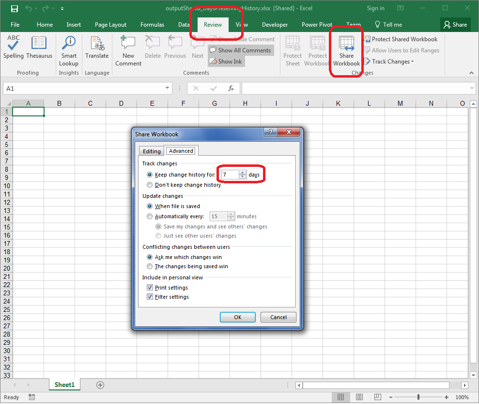

## **Possible Usage Scenarios**

When you share a workbook, you get an option saying ***Keep change history for N days*** as shown in the following screenshot. You can update the number of days for preserving history using Aspose.Cells with [**WorksheetCollection.RevisionLogs.DaysPreservingHistory**](https://apireference.aspose.com/cells/java/com.aspose.cells/revisionlogcollection#DaysPreservingHistory) property.

## **Update Days Preserving History of Revision Logs in Shared Workbook**

The following sample code creates an empty workbook, then shares it and updates the revision logs days preserving history to 7 days which is normally 30 days. Please see the [output Excel file](60489784.xlsx) generated by the code for a reference.

## **Sample Code**


