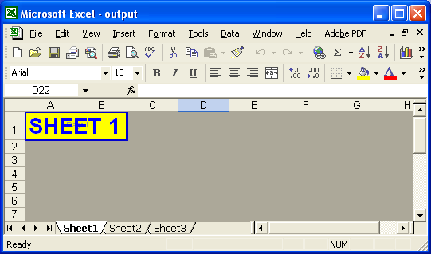
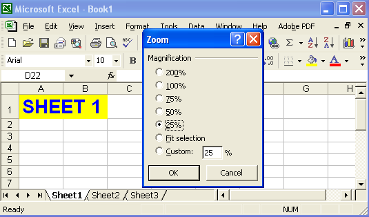
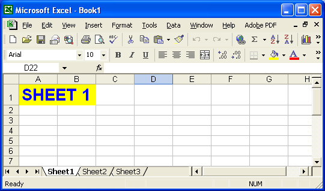
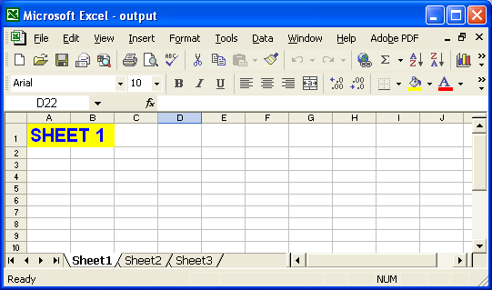
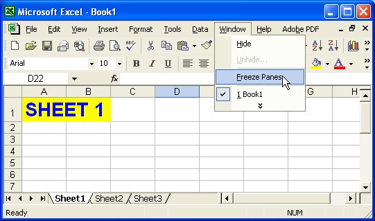
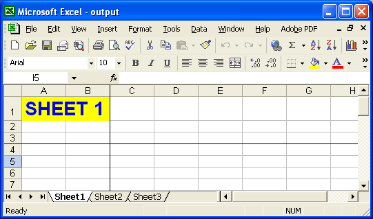
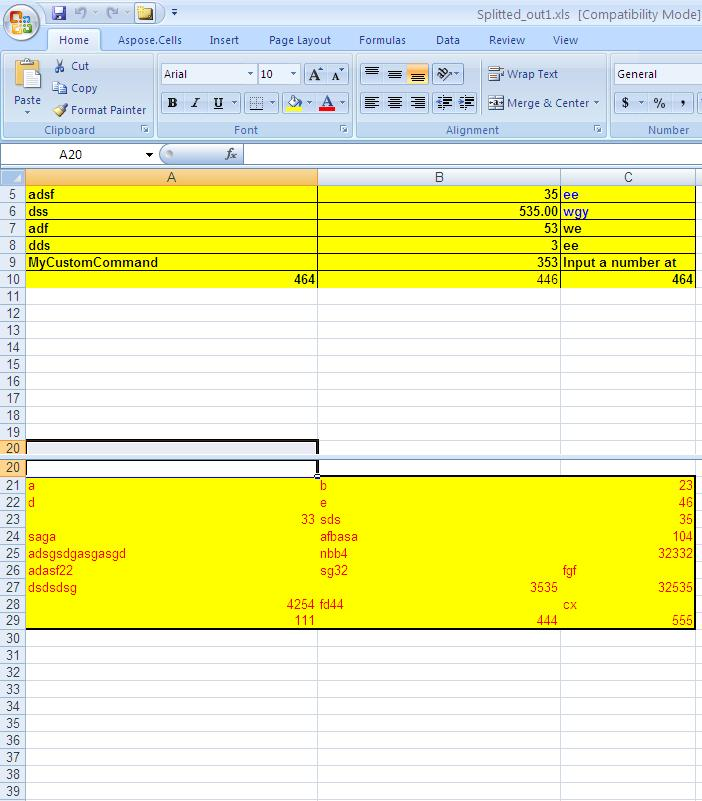

## **Page Break Preview**
All worksheets can be viewed in two modes:

- Normal view.
- Page break preview.

A normal view is a worksheet's default view. Page break preview is an editing view that displays a worksheet as it will print. Page break preview shows what data will go on each page so you can adjust the print area and page breaks. Using Aspose.Cells developers can enable normal view or page break preview modes.
### **Controlling View Modes**
Aspose.Cells provides a [Workbook](https://reference.aspose.com/cells/java/com.aspose.cells/workbook) class that represents a Microsoft Excel file. The [Workbook](https://reference.aspose.com/cells/java/com.aspose.cells/workbook) class contains a [WorksheetCollection](https://reference.aspose.com/cells/java/com.aspose.cells/worksheetcollection) that allows access to each worksheet in an Excel file.

A worksheet is represented by the [Worksheet](https://reference.aspose.com/cells/java/com.aspose.cells/worksheet) class. The [Worksheet](https://reference.aspose.com/cells/java/com.aspose.cells/worksheet) class provides a wide range of properties and methods for managing worksheets. To enable normal or page break preview modes, use the [Worksheet](https://reference.aspose.com/cells/java/com.aspose.cells/worksheet) class' [setPageBreakPreview](https://reference.aspose.com/cells/java/com.aspose.cells/worksheet#IsPageBreakPreview) method.
#### **Enabling Normal View**
Set any worksheet to normal view by using the [setPageBreakPreview](https://reference.aspose.com/cells/java/com.aspose.cells/worksheet#IsPageBreakPreview) method of the [Worksheet](https://reference.aspose.com/cells/java/com.aspose.cells/worksheet) class and passing **false** as a parameter.
#### **Enabling Page Break Preview**
Set any worksheet to page break preview using the [setPageBreakPreview](https://reference.aspose.com/cells/java/com.aspose.cells/worksheet#IsPageBreakPreview) method of the [Worksheet](https://reference.aspose.com/cells/java/com.aspose.cells/worksheet) class and passing **true** as a parameter.

A complete example is given below that demonstrates the use of the [Worksheet](https://reference.aspose.com/cells/java/com.aspose.cells/worksheet) class' [setPageBreakPreview](https://reference.aspose.com/cells/java/com.aspose.cells/worksheet#IsPageBreakPreview) method to enable the page break preview mode for the first worksheet of the Excel file.

In the screenshot below, you can see that Book1.xls file is in Normal View.

**Book1.xls: Worksheet before modification** 

Book1.xls is opened with the [Workbook](https://reference.aspose.com/cells/java/com.aspose.cells/workbook) class and the mode is switched to page break preview for the first worksheet. The modified file is saved as output.xls.

**Ouput.xls: worksheet after modification** 


## **Zoom Factor**
Microsoft Excel provides a feature that lets users set a worksheet's zoom or scaling factor. This feature helps users to see the worksheet contents in smaller or larger views. Users can set the zoom factor to any value.

**Setting the Zoom Factor using Microsoft Excel** 

Aspose.Cells also allows developers to set the worksheet zoom factor.
### **Controlling the Zoom Factor**
Aspose.Cells provides a [Workbook](https://reference.aspose.com/cells/java/com.aspose.cells/workbook) class that represents a Microsoft Excel file. The [Workbook](https://reference.aspose.com/cells/java/com.aspose.cells/workbook) class contains a [WorksheetCollection](https://reference.aspose.com/cells/java/com.aspose.cells/worksheetcollection) that allows access to each worksheet in an Excel file.

A worksheet is represented by the [Worksheet](https://reference.aspose.com/cells/java/com.aspose.cells/worksheet) class. The [Worksheet](https://reference.aspose.com/cells/java/com.aspose.cells/worksheet) class provides a wide range of properties and methods for managing worksheets. To set a worksheet's zoom factor, use the [Worksheet](https://reference.aspose.com/cells/java/com.aspose.cells/worksheet) class' [setZoom ](https://reference.aspose.com/cells/java/com.aspose.cells/worksheet#Zoom)method.

A complete example is given below that demonstrates how to use the [setZoom ](https://reference.aspose.com/cells/java/com.aspose.cells/worksheet#Zoom)method to set the zoom factor of the first worksheet in an Excel file.

In the screenshot below, you can see the Book1.xls file in the default view.

**Book1.xls: worksheet before modification** 

The Book1.xls file is opened with the [Workbook](https://reference.aspose.com/cells/java/com.aspose.cells/workbook) class and the zoom factor of the first worksheet is set to 75. The modified file is saved as output.xls.

**Output.xls: worksheet after modification** 


## **Freeze Panes**
Freeze panes is a feature provided by Microsoft Excel. Freezing panes allows you to select data to remain visible when scrolling in a worksheet.

**Using freeze panes in Microsoft Excel** 

Aspose.Cells also allows developers to apply freeze panes to worksheets at runtime.

Aspose.Cells provides a [Workbook](https://reference.aspose.com/cells/java/com.aspose.cells/workbook) class that represents a Microsoft Excel file. The [Workbook](https://reference.aspose.com/cells/java/com.aspose.cells/workbook) class contains a [WorksheetCollection](https://reference.aspose.com/cells/java/com.aspose.cells/worksheetcollection) that allows access to each worksheet in an Excel file.

A worksheet is represented by the [Worksheet](https://reference.aspose.com/cells/java/com.aspose.cells/worksheet) class. The [Worksheet](https://reference.aspose.com/cells/java/com.aspose.cells/worksheet) class provides a wide range of properties and methods for managing worksheets. To configure freeze panes, call the [Worksheet](https://reference.aspose.com/cells/java/com.aspose.cells/worksheet) class' [freezePanes](https://reference.aspose.com/cells/java/com.aspose.cells/worksheet#freezePanes\(int,%20int,%20int,%20int\)) method. The [freezePanes](https://reference.aspose.com/cells/java/com.aspose.cells/worksheet#freezePanes\(int,%20int,%20int,%20int\)) method takes the following parameters:

- **Row**, the row index of the cell that the freeze will start from.
- **Column**, the column index of the cell that the freeze will start from.
- **Frozen rows**, the number of visible rows in the top pane.
- **Frozen columns**, the number of visible columns in the left pane

A complete example is given below that shows how to use the [Worksheet](https://reference.aspose.com/cells/java/com.aspose.cells/worksheet) class' [freezePanes](https://reference.aspose.com/cells/java/com.aspose.cells/worksheet#freezePanes\(int,%20int,%20int,%20int\)) method to freeze rows and columns (starting from C4, represented by 4th row and 3rd column, where the rows and columns start from 0 indexes) of the first worksheet of the Excel file.



In the screenshot below, you can see Book1.xls file without freeze panes.

**Book1.xls: worksheet view before any modification** 

The Book1.xls file is opened with the [Workbook](https://reference.aspose.com/cells/java/com.aspose.cells/workbook) class and then a few rows and columns are frozen on the first worksheet. The modified file is saved as output.xls.

**Outlook.xls: worksheet view after modification** 

## **Split Panes**
If you need to split the screen to get two different views in the same worksheet, split panes. Microsoft Excel offers a very handy feature that allows you to view more than one copy of your worksheet, and for you to be able to scroll through each pane of your worksheet independently: split panes.

The panes work simultaneously. If you make a change in one, the change simultaneously appears in the other. Aspose.Cells provides the split panes feature for the users.
### **Applying and Removing Split Panes**
#### **Splitting Panes**
Aspose.Cells provides a [Workbook](https://reference.aspose.com/cells/java/com.aspose.cells/workbook) class that represents a Microsoft Excel file. The [Workbook](https://reference.aspose.com/cells/java/com.aspose.cells/workbook) class provides a wide range of properties and methods for managing Excel files. To implement split views, use the [Worksheet](https://reference.aspose.com/cells/java/com.aspose.cells/worksheet) class' [split](https://reference.aspose.com/cells/java/com.aspose.cells/worksheet#split\(\)) method. To remove split panes, use the [removeSplit](https://reference.aspose.com/cells/java/com.aspose.cells/worksheet#removeSplit\(\)) method.

In the example, we use a simple template file that is loaded, then the set split panes feature is applied on a cell in the first worksheet. The updated file is saved.



After running the above code, the generated file has a split view.

**Split panes in the output file** 

#### **Removing Panes**
Developers can remove split panes using the [Worksheet](https://reference.aspose.com/cells/java/com.aspose.cells/worksheet) class' [removeSplit](https://reference.aspose.com/cells/java/com.aspose.cells/worksheet#removeSplit\(\)) method.



## **Advance topics**
- [Hiding the Display of Zero Values in the Worksheet](/cells/java/hiding-the-display-of-zero-values-in-the-worksheet/)
- [Set Worksheet Tab Color](/cells/java/set-worksheet-tab-color/)
- [Show and Hide Elements](/cells/java/show-and-hide-elements/)
- [Show Formulas instead of Values in a Worksheet](/cells/java/show-formulas-instead-of-values-in-a-worksheet/)
- [Use Error Checking Options](/cells/java/use-error-checking-options/)