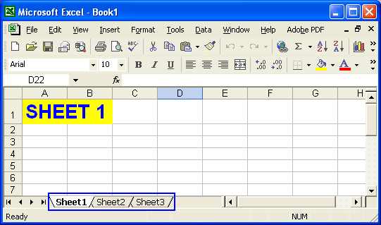
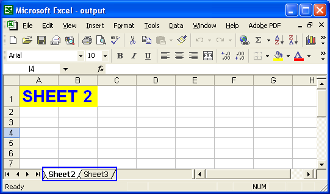
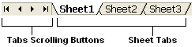
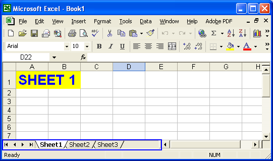
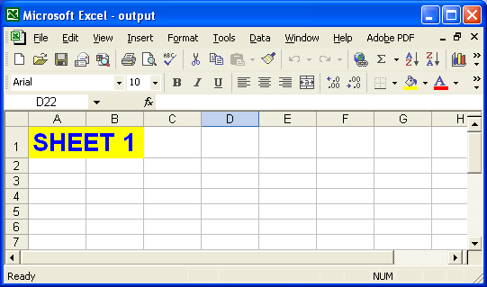
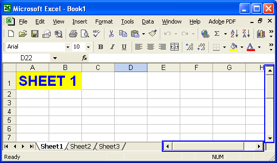
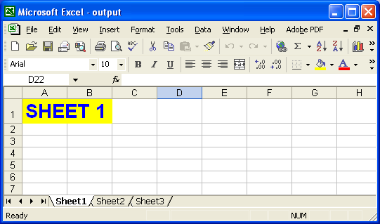
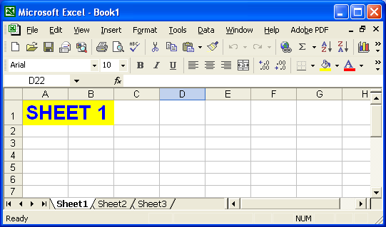
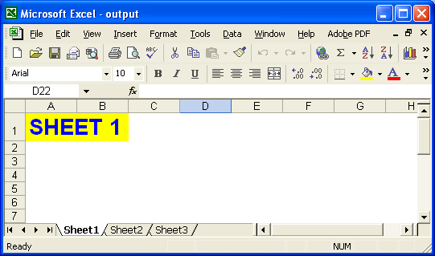

{}

Aspose.Cells allows the user to show and hide elements of a workbook including worksheets, rows, columns, tabs, scrollbars, gridlines,

{}

## **Show and Hide a Worksheet**

An Excel file can have one or more than one worksheets. Whenever we create an Excel file, we add worksheets to the Excel file in which we work. Each worksheet in an Excel file is independent from the other worksheet by having its own data and formatting settings etc. Sometimes, developers may require to make few worksheets hidden and others visible in the Excel file for their own interest. So, **Aspose.Cells** allows developers to control the visibility of the worksheets in their Excel files.

**Controlling the Visibility of the Worksheets:**

Aspose.Cells provides a class, [**Workbook**](https://reference.aspose.com/cells/java/com.aspose.cells/workbook) that represents an Excel file. [**Workbook**](https://reference.aspose.com/cells/java/com.aspose.cells/workbook) class contains a [**WorksheetCollection**](https://reference.aspose.com/cells/java/com.aspose.cells/WorksheetCollection) that allows to access each worksheet in the Excel file.

A worksheet is represented by the [**Worksheet**](https://reference.aspose.com/cells/java/com.aspose.cells/worksheet) class. [**Worksheet**](https://reference.aspose.com/cells/java/com.aspose.cells/worksheet) class provides a wide range of properties and methods to manage a worksheet. But, to control the visibility of a worksheet, developers may use [**setVisible**](https://reference.aspose.com/cells/java/com.aspose.cells/worksheet#IsVisible) method of the [**Worksheet**](https://reference.aspose.com/cells/java/com.aspose.cells/worksheet) class.

### **Making a Worksheet Visible**

Developers can make a worksheet visible by passing **true** as a parameter to the [**setVisible**](https://reference.aspose.com/cells/java/com.aspose.cells/worksheet#IsVisible) method of the [**Worksheet**](https://reference.aspose.com/cells/java/com.aspose.cells/worksheet) class.

### **Hiding a Worksheet**

Developers can hide a worksheet by passing **false** as a parameter to the [**setVisible**](https://reference.aspose.com/cells/java/com.aspose.cells/worksheet#IsVisible) method of the [**Worksheet**](https://reference.aspose.com/cells/java/com.aspose.cells/worksheet) class.

**Example:**

A complete example is given below that demonstrates the use of [**setVisible(false)**](https://reference.aspose.com/cells/java/com.aspose.cells/worksheet#IsVisible) method of [**Worksheet**](https://reference.aspose.com/cells/java/com.aspose.cells/worksheet) class to hide the first worksheet of the Excel file.



**Worksheet - Before Modification:**

In the screenshot below, you can see that **Book1.xls** file contains three worksheets: **Sheet1** , **Sheet2** and **Sheet3** .

**Figure:** Worksheet view before any modification

**Worksheet - After Executing the Example Code:**

**Book1.xls** file is opened using the [**Workbook**](https://reference.aspose.com/cells/java/com.aspose.cells/workbook) class and then the first worksheet of the **Book1.xls** file is made hidden. The modified file is saved as **output.xls** file whose pictorial view is shown below:

**Figure:** Worksheet view after modification

**Setting VisibilityType**

You can also hide the worksheets in a special way. This feature can h ide the worksheet so that the only way for you to make it visible again is by giving [**VisibilityType.VERY_HIDDEN**](https://reference.aspose.com/cells/java/com.aspose.cells/visibilitytype#VERY_HIDDEN) as parameter value for the [**setVisibilityType**](https://reference.aspose.com/cells/java/com.aspose.cells/worksheet#VisibilityType) method in the code ( it is to be noted here, the user s cannot make the object visible in MS Excel directly by using its menu options). Users can also use [**getVisibilityType**](https://reference.aspose.com/cells/java/com.aspose.cells/worksheet#VisibilityType) method to check whether a worksheet is marked as VeryHidden or not.

## **Show or Hide Tabs**

If you closely look at the bottom of a Microsoft Excel file, you will see a number of controls. These include:

- Sheet tabs.
- Tab scrolling buttons.

Sheet tabs represent the worksheets in the Excel file. Click any tab to switch to that worksheet. The more worksheets in the workbook, the more sheet tabs there are. If the Excel file has a good number of worksheets you need buttons to navigate through them. So, Microsoft Excel provides tab scrolling buttons for scrolling through the sheet tabs.

**Sheet tabs & tab scrolling buttons**

Using Aspose.Cells, developers can control the visibility of sheet tabs and tabs scrolling buttons in Excel files.

**Controlling the Visibility of Tabs:**
Aspose.Cells provides a class, [**Workbook**](https://reference.aspose.com/cells/java/com.aspose.cells/workbook), that represents a Microsoft Excel file. The [**Workbook**](https://reference.aspose.com/cells/java/com.aspose.cells/workbook) class provides a wide range of properties and methods for managing an Excel file.

### **Hiding Tabs**

Hide tabs in an Excel file by setting the [**Workbook**](https://reference.aspose.com/cells/java/com.aspose.cells/workbook) class' [**getSettings().setShowTabs(false)**](https://reference.aspose.com/cells/java/com.aspose.cells/workbooksettings#ShowTabs) method.



### **Making Tabs Visible**

Make tabs visible with the [**Workbook**](https://reference.aspose.com/cells/java/com.aspose.cells/workbook) class' [**getSettings().setShowTabs(true)**](https://reference.aspose.com/cells/java/com.aspose.cells/workbooksettings#ShowTabs) method.



**Complete Code Example:**

Below is a complete example that opens an Excel file (book1.xls), hides its tabs and saves the modified file as output.xls.

You can see that Book1.xls file contains tabs in the figure below. After the example code is executed, the tabs are hidden, as you can see from the screenshot of the output.xls file below.

**book1.xls: Excel file before any modification**

**output.xls: Excel file after modification**



## **Show and Hide Rows and Columns**

All worksheets in an Excel file are composed of cells that are arranged in rows and columns. All rows and columns have unique values that are used to identify them, and to identify individual cells. For example, rows are numbered – 1, 2, 3, 4, etc. – and columns are ordered alphabetically – A, B, C, D, etc. The row and column values are displayed in the headers. Using Aspose.Cells, developers can control the visibility of these row and column headers.

**Controlling the Visibility of the Worksheets:**

Aspose.Cells provides a class, [**Workbook**](https://reference.aspose.com/cells/java/com.aspose.cells/workbook), that represents a Microsoft Excel file. The Workbook class contains a WorksheetCollection that allows access to each worksheet in an Excel file.

A worksheet is represented by the [**Worksheet**](https://reference.aspose.com/cells/java/com.aspose.cells/worksheet) class. The Worksheet class provides a wide range of properties and methods for managing worksheets. To control the visibility of row and column headers, use the Worksheet class' [**setRowColumnHeadersVisible**](https://reference.aspose.com/cells/java/com.aspose.cells/worksheet#IsRowColumnHeadersVisible) method.

### **Hiding Row/Column Headers**

Hide row and column headers by using the [**Worksheet**](https://reference.aspose.com/cells/java/com.aspose.cells/worksheet) class' [**setRowColumnHeadersVisible(false)**](https://reference.aspose.com/cells/java/com.aspose.cells/worksheet#IsRowColumnHeadersVisible) method.

### **Making Row/Column Headers Visible**

Make row and column headers visible by using the [**Worksheet**](https://reference.aspose.com/cells/java/com.aspose.cells/worksheet) class' [**setRowColumnHeadersVisible(true)**](https://reference.aspose.com/cells/java/com.aspose.cells/worksheet#IsRowColumnHeadersVisible) method.

A complete example is given below that demonstrates how to use the [**Worksheet**](https://reference.aspose.com/cells/java/com.aspose.cells/worksheet) class' [**setRowColumnHeadersVisible(false)**](https://reference.aspose.com/cells/java/com.aspose.cells/worksheet#IsRowColumnHeadersVisible) method to hide row and column headers of the first worksheet of an Excel file.

The screenshot below shows that Book1.xls contains three worksheets: Sheet1, Sheet2 and Sheet3. Each worksheet is showing row and column headers.

**Book1.xls: worksheet before modification**

Book1.xls is opened using the [**Workbook**](https://reference.aspose.com/cells/java/com.aspose.cells/workbook) class' and the row and column headers on the first worksheet are hidden. The modified file is saved as output.xls.

**Worksheet view after modification**



## **Show and Hide Scroll Bars**

Scroll bars are very used to navigate the contents of any file. Normally, there are two kinds of scroll bars:

- Vertical scroll bars
- Horizontal scroll bars

Microsoft Excel also provides horizontal and vertical scroll bars so that users can scroll through worksheet contents. Using Aspose.Cells, developers can control the visibility of both types of scroll bars in Excel files.

**Controlling the Visibility of the Scroll Bars:**

Aspose.Cells provides a class, [**Workbook**](https://reference.aspose.com/cells/java/com.aspose.cells/workbook) that represents an Excel file. [**Workbook**](https://reference.aspose.com/cells/java/com.aspose.cells/workbook) class provides a wide range of properties and methods to manage an Excel file. But, to control the visibility of the scroll bars in the Excel file, developers may use [**setVScrollBarVisible**](https://reference.aspose.com/cells/java/com.aspose.cells/workbooksettings#IsVScrollBarVisible) & [**setHScrollBarVisible**](https://reference.aspose.com/cells/java/com.aspose.cells/workbooksettings#IsHScrollBarVisible) methods of the [**Workbook**](https://reference.aspose.com/cells/java/com.aspose.cells/workbook) class.

### **Hiding Scroll Bars**

Hide scroll bars by setting the [**Workbook**](https://reference.aspose.com/cells/java/com.aspose.cells/workbook) class' [**setVScrollBarVisible**](https://reference.aspose.com/cells/java/com.aspose.cells/workbooksettings#IsVScrollBarVisible) or [**setHScrollBarVisible**](https://reference.aspose.com/cells/java/com.aspose.cells/workbooksettings#IsHScrollBarVisible) methods to **false**.

### **Making Scroll Bars Visible**

Make scroll bars visible by setting the Workbook class' [**setVScrollBarVisible**](https://reference.aspose.com/cells/java/com.aspose.cells/workbooksettings#IsVScrollBarVisible) or [**setHScrollBarVisible**](https://reference.aspose.com/cells/java/com.aspose.cells/workbooksettings#IsHScrollBarVisible) methods to **true**.

**Complete Code Example:**

Below is a complete code that opens an Excel file, book1.xls, hides both scroll bars and then saves the modified file as output.xls.

The screenshot below shows Book1.xls file containing both scroll bars. The modified file is saved as output.xls file, also shown below.

**Book1.xls: Excel file before any modification**

**output.xls: Excel file after modification**



## **Show and Hide Gridlines**

All Microsoft Excel worksheets have gridlines by default. They help delineate cells, so that it is easy to enter data into particular cells. Gridlines enable us to view a worksheet as a collection of cells, where each cell is easily identifiable.

Aspose.Cells also allows you to control the visibility of the gridlines.

### **Controlling the Visibility of Gridlines**

Aspose.Cells provides a class, [**Workbook**](https://reference.aspose.com/cells/java/com.aspose.cells/workbook) that represents a Microsoft Excel file. The [**Workbook**](https://reference.aspose.com/cells/java/com.aspose.cells/workbook) class contains a [**WorksheetCollection**](https://reference.aspose.com/cells/java/com.aspose.cells/WorksheetCollection) that allows access to each worksheet in the file.

A worksheet is represented by the [**Worksheet**](https://reference.aspose.com/cells/java/com.aspose.cells/worksheet) class. The [**Worksheet**](https://reference.aspose.com/cells/java/com.aspose.cells/worksheet) class provides a wide range of properties and methods for managing worksheets. To control the visibility of gridlines, use the the [**Worksheet**](https://reference.aspose.com/cells/java/com.aspose.cells/worksheet) class' [**setGridlinesVisible**](https://reference.aspose.com/cells/java/com.aspose.cells/worksheet#IsGridlinesVisible) method.

#### **Making Gridlines Visible**

To make gridlines visible, use the the [**Worksheet**](https://reference.aspose.com/cells/java/com.aspose.cells/worksheet) class' [**setGridlinesVisible(true)**](https://reference.aspose.com/cells/java/com.aspose.cells/worksheet#IsGridlinesVisible) method.

#### **Hiding Gridlines**

Hide gridlines using the the [**Worksheet**](https://reference.aspose.com/cells/java/com.aspose.cells/worksheet) class' [**setGridlinesVisible(false)**](https://reference.aspose.com/cells/java/com.aspose.cells/worksheet#IsGridlinesVisible) method.

{}

Gridlines are applied to the entire sheet. To 'hide' gridlines on a section of a worksheet, use [border formatting](/cells/java/create-table-by-using-border-lines-for-a-range/) to set the borders to a color that blends into the sheet's color scheme.

{}

**Example: Hiding Gridlines on a Particular Worksheet**

The example below demonstrates the use of the [**Worksheet**](https://reference.aspose.com/cells/java/com.aspose.cells/worksheet) class' [**setGridlinesVisible(false)**](https://reference.aspose.com/cells/java/com.aspose.cells/worksheet#IsGridlinesVisible) method to hide gridlines of the first worksheet of an Excel file.

The screenshot below shows that the Book1.xls file contains three worksheets: Sheet1, Sheet2 and Sheet3. All of these worksheets have gridlines.

**Worksheet view before modification**

The Book1.xls file is opened using the [**Workbook**](https://reference.aspose.com/cells/java/com.aspose.cells/workbook) class and then the gridlines of the first worksheet are hidden. The modified file is saved as output.xls file.

**Worksheet view after modification**



### **Related Articles**

{}

- [Page Setup Features](/cells/java/page-setup-features/).
- [Adding borders to cells to create a table](/cells/java/create-table-by-using-border-lines-for-a-range/).

{}
