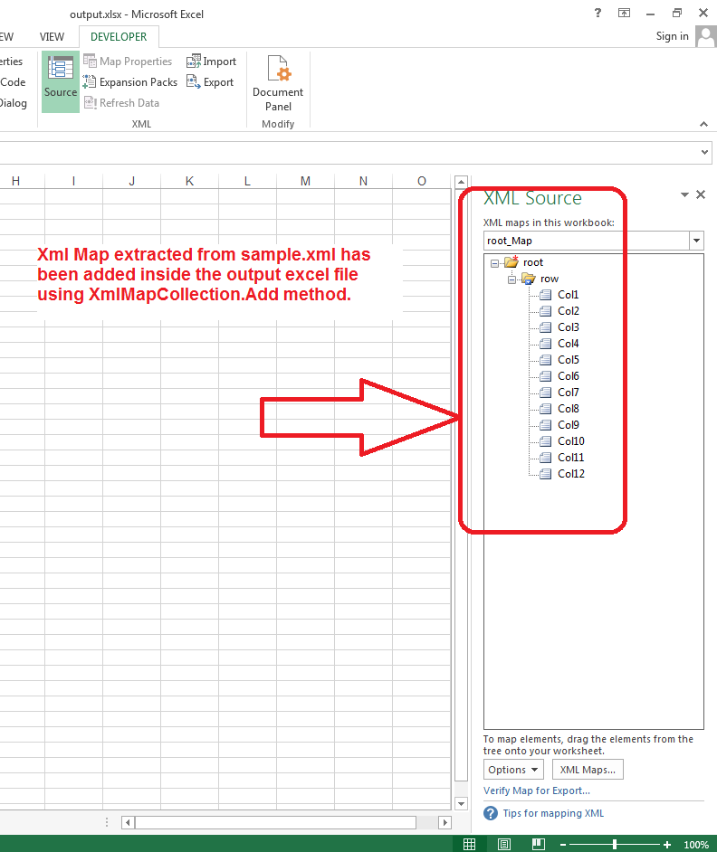

## **Possible Usage Scenarios**

Aspose.Cells provides [**XmlMapCollection.Add()**](https://apireference.aspose.com/cells/java/com.aspose.cells/xmlmapcollection#add(java.lang.Object)) method which you can use to import your XML Map inside the workbook.

## **Add XML Map inside the Workbook using XmlMapCollection.Add method**

The following sample code adds XML Map inside the workbook using the [**XmlMapCollection.Add()**](https://apireference.aspose.com/cells/java/com.aspose.cells/xmlmapcollection#add(java.lang.Object)) method and saves it as [output excel file](5472533.xlsx). The screenshot shows the XML Map that has been imported from the [sample.xml](5472532.xml) inside the output excel file.

## **Sample Code**


