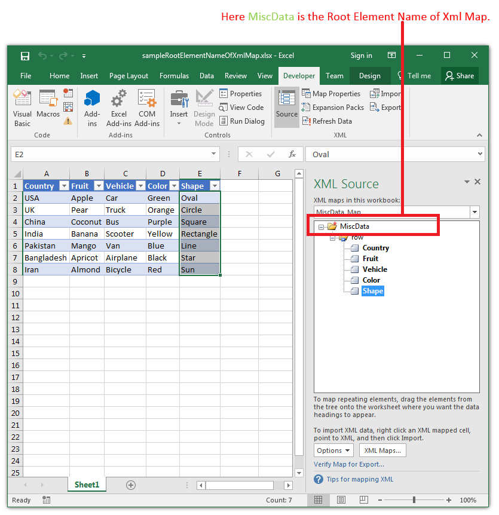

## **Possible Usage Scenarios**

You can find the *Root Element Name of XML Map* using Aspose.Cells with [**XmlMap.RootElementName**](https://apireference.aspose.com/cells/java/com.aspose.cells/xmlmap#RootElementName) property. The following screenshot shows the root element name of the XML Map in Microsoft Excel.

## **Sample Code**

The following sample code loads the [sample Excel file](55541816.xlsx) and accesses the first XML Map and prints its [**XmlMap.RootElementName**](https://apireference.aspose.com/cells/java/com.aspose.cells/xmlmap#RootElementName) property. Please see the console output of the sample code given below.



## **Console Output**



Root Element Name Of Xml Map: MiscData


