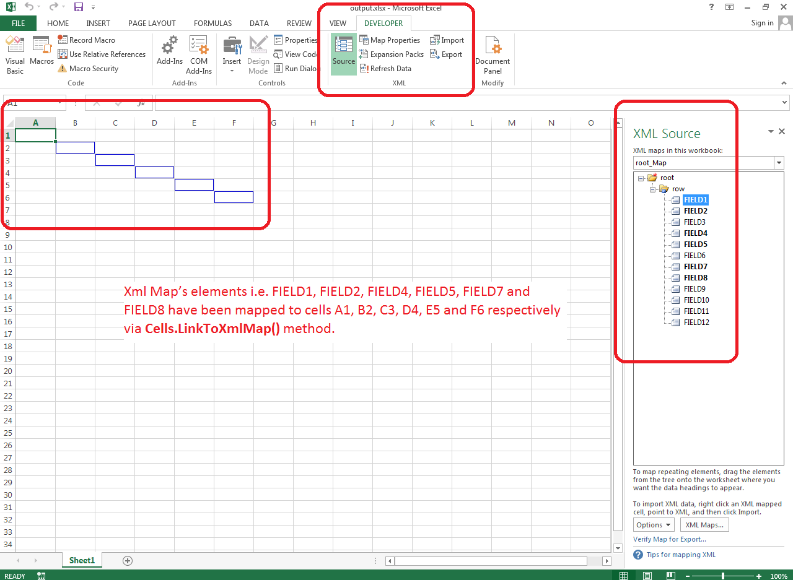

## **Possible Usage Scenarios**

You can link your cells to XML Map elements using Aspose.Cells. Please use the [**Cells.LinkToXmlMap()**](https://reference.aspose.com/cells/java/com.aspose.cells/cells#linkToXmlMap(java.lang.String,%20int,%20int,%20java.lang.String)) method for this purpose.

## **Link Cells to XML Map Elements**

The following sample code loads the [source excel file](5472518.xlsx) which contains XML Map and then links cells A1, B2, C3, D4, E5, and F6 to XML Map elements FIELD1, FIELD2, FIELD4, FIELD5, FIELD7, and FIELD8 respectively and then saves the workbook in [output excel file](5472517.xlsx).

If you open the [output excel file](5472517.xlsx) and click the *Developer > Source* button, you will see the cells are linked with XML Map elements and they will also be highlighted by Microsoft Excel as shown in this image.

## **Sample Code**


