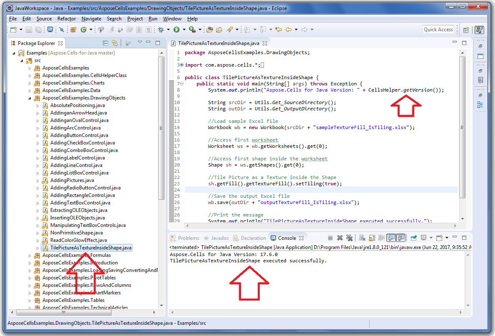

## **Download from GitHub**
All examples of Aspose.Cells for Java are hosted on [GitHub](https://github.com/aspose-cells/Aspose.Cells-for-java). You can either clone the repository using your favorite GitHub client or download the ZIP file from [here](https://github.com/aspose-cells/Aspose.Cells-for-java/archive/master.zip).

Extract the contents of ZIP file to any folder on your computer. All the examples are located in the **Examples** folder.

The **Resources** folder contains input documents or files used in the examples.

{} 

Examples are in the form of **Eclipse Project**. Please open the Examples in Eclipse using the **File > Open Projects from File System...** menu command and follow the steps. Now, you should be able to run the examples fine.

{} 
## **Run the Example**
Once, you open the Examples in the Eclipse IDE, then select any .java file. For example, select this one.

TilePictureAsTextureInsideShape.java

found inside the

Examples>src>AsposeCellsExamples>DrawingObjects directory

or inside the package

AsposeCellsExamples.DrawingObjects

and run it.
## **Screenshot**
Please see the following screenshot and its highlighted areas for more help.

