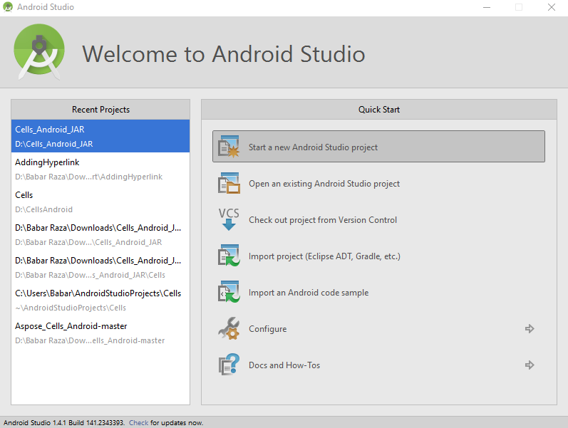
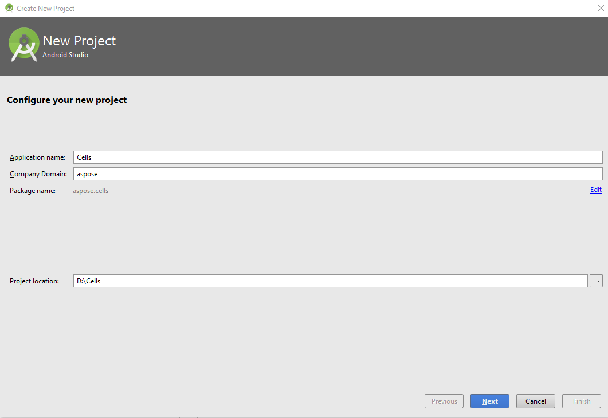
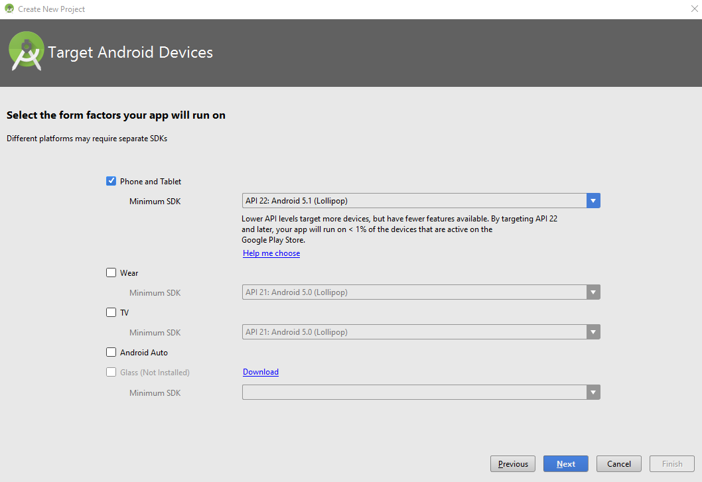
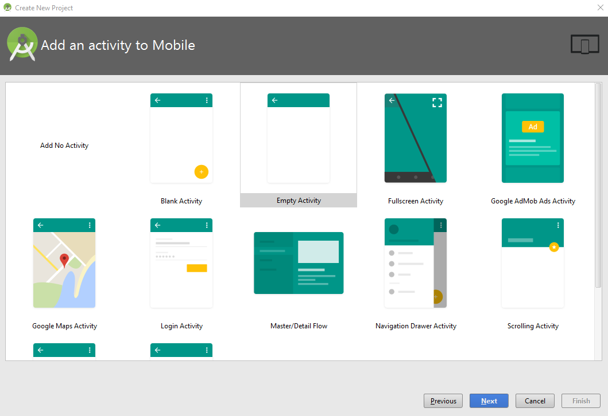
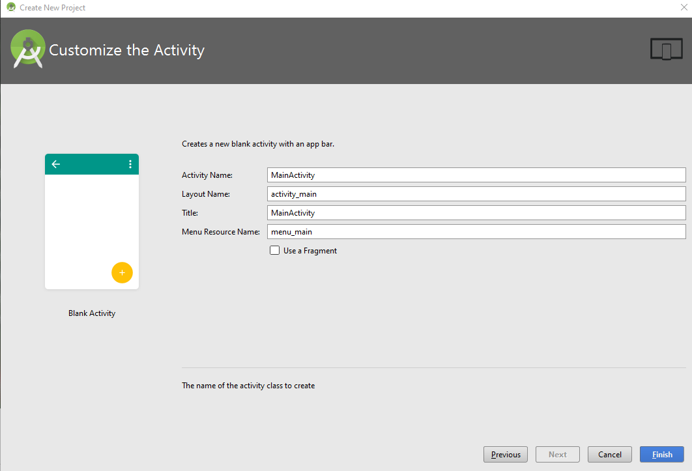
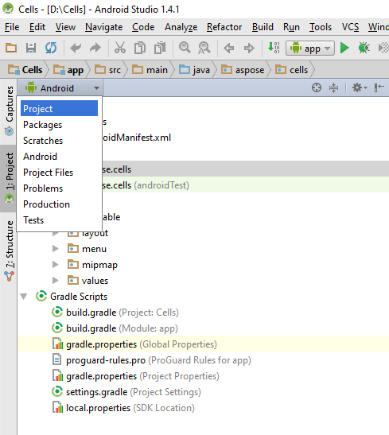
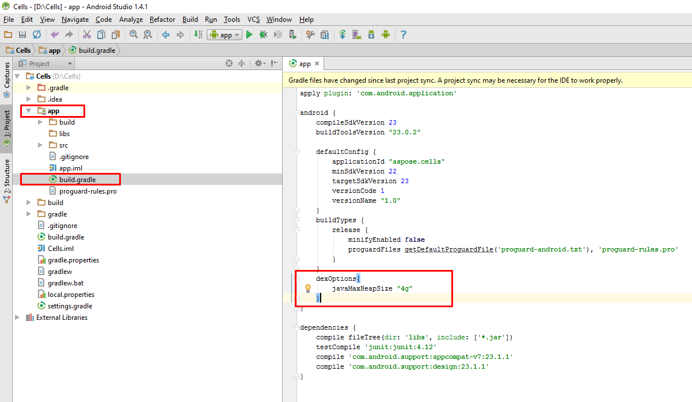
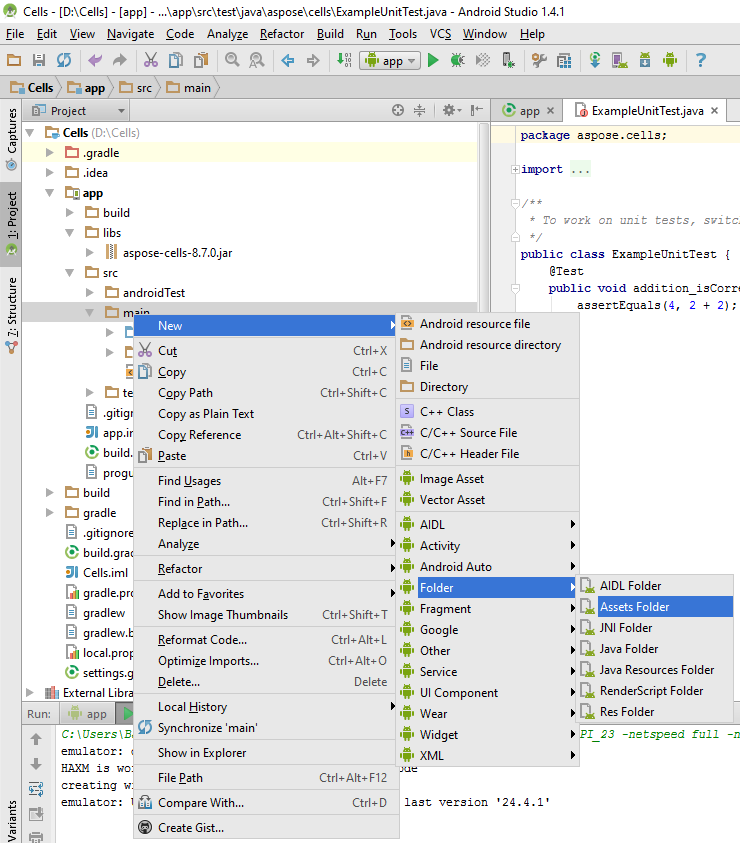
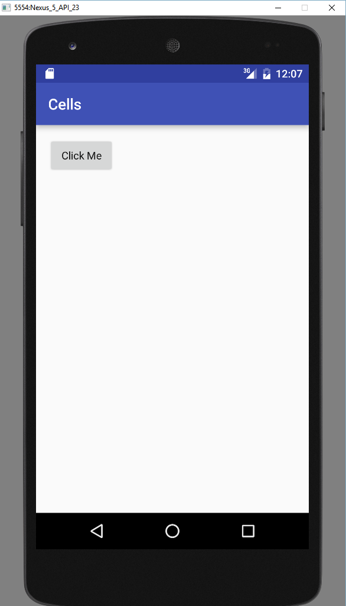
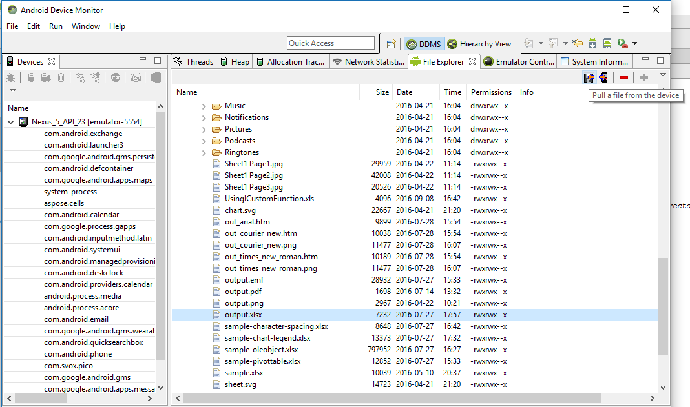

## **System Requirements**
Aspose.Cells for Android via Java is platform-independent and can be used on any platform where the Android Runtime environment is installed and will run on Android systems running Android OS 2.0 or greater. At present, the component has been tested with:

- Android 4.2 v 17
## **Install Aspose.Cells for Android via Java from Maven Repository**
1. Add maven repository into your build.gradle 
1. Add 'Aspose.Cells for Android via Java' JAR as a dependency



 // 1. Add maven repository into your build.gradle 

repositories {

    mavenCentral()

    maven { url "http://repository.aspose.com/repo/" }

}

// 2. Add 'Aspose.Cells for Android via Java' JAR as a dependency

dependencies {

    ...

    ...

    compile (group: 'com.aspose', name: 'aspose-cells', version: '20.6', classifier: 'android.via.java')

}


## **How to use Aspose.Cells for Android via Java**
This topic will guide you through the necessary steps to setup Aspose.Cells for Android via Java in Android Studio IDE, assuming that you already have the latest version of Android Studio installed on your machine and you have also acquired the latest version of Aspose.Cells for Android via Java package.

{} 

If you haven't installed the Android Studio yet, you have to first acquire the setup of Android Studio and install it on your machine. You can download the latest version of Android Studio from [here](https://developer.android.com/studio/index.html#win-bundle) whereas the details on how to install the IDE are available [here](https://developer.android.com/studio/install.html).

{} {} 

Aspose.Cells for Android via Java package can be downloaded from [here](https://downloads.aspose.com/cells/androidjava). Please note, each release package of Aspose.Cells for Android via Java mainly consists of 2 files as detailed below.

- **aspose-cells-x.x.x.jar** is the main library file containing all the namespaces from Aspose.Cells for Android via Java API.
- **aspose-cells-x.x.x-libs.apk** is the APK containing the 3rd party bcprov-jdk15-146.jar used for encryption and decryption facilities offered by Aspose.Cells for Android via Java API.

{} 
### **Getting Started with Aspose.Cells for Android via Java in Android Studio**
Once the Android Studio IDE loads, click on File > New > New Project as shown below.

You can also create a new project from the Android Studio's Welcome Screen as shown below.

Next, you will be prompt to specify the application name, domain & location to store the project files. You can choose to change the default values as per your choice or let them as they are, and click Next.

In the next step, you have to specify the Android Device you wish to host/run your application. Once selected, click on Next button.

Now you need to select the Activity from a predefined list of templates. In order to keep the demonstration simple, we have selected the Empty Activity template as shown below.

Click on Finish button on the Customize the Activity dialog as we will keep all the default settings as they are.

As soon as you click on the Finish button on the previous step, the IDE will start building the project as shown below. Let it finish or click the Cancel button.

Now the project has been loaded in the IDE, however, you may wish to change the view to Project so that you can view the complete hierarchy of the project files. In order to change the view, please check the following snapshot.

After changing the view to Project, find & load the **build.gradle** file in the editor and paste the following snippet as shown below.



 dexOptions{

    javaMaxHeapSize "4g"

}



Next, we will add the Aspose.Cells for Android via Java Jar to the project. There are 2 important steps as detailed below.

- Manually copy the Aspose.Cells for Android via Java Jar to the **\app\libs** folder.
- Add Aspose.Cells for Android via Java Jar as Library to the module as shown below.

You will be prompt to select the module to which you wish to add the Aspose.Cells for Java.Android Jar as a library. Please choose appropriately and click OK.

You also need to add the APK file to the project. You have to copy the APK to the **\app\src\main\assets** folder. If you do not have the assets folder under the main folder, you can create one by right-clicking the main node in the Project view. Select New > Folder > Asset Folder.

Once the APK has been added to the project, it needs to be loaded by the project. There are 2 ways to load the APK as follow.

- Load the APK in a custom application class using the snippet provided below, and register the custom application class to the AndroidManifest.xml.



 LibsLoadHelper.loadLibs(this);



- Load the APK in the OnCreate method of MainActivity.



 LibsLoadHelper.loadLibs(getApplicationContext());



Now we are ready to write the code. In order to keep the demonstration easy to understand, we have added a Button widget to the layout and going to handle its click event as follow.



 private class TestTask extends AsyncTask<Void, String, Boolean> {

    @Override

    protected Boolean doInBackground(Void... params) {

        Boolean result = false;

        Workbook book = new Workbook();

        Worksheet sheet = book.getWorksheets().get(0);

        Cells cells = sheet.getCells();

        Cell cell = cells.get("A1");

        cell.putValue("Hello World!");

        try {

            book.save(SD_PATH + "output.xlsx");

        } catch (Exception e) {

            e.printStackTrace();

        }

        return result;

    }

}



When you run the application using the play button on IDE interface (or using SHIFT + F10) the emulator will load the application as shown below.

Clicking the button on the emulator will execute the code to create a new spreadsheet in the external storage folder of the emulator. You can access the file from the Android Device Monitor as shown below.

