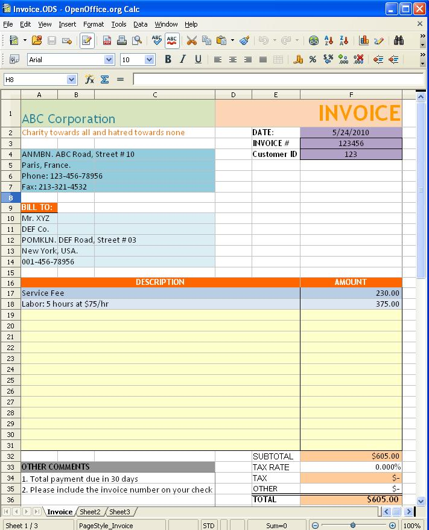

## **About OpenDocument**

The [OpenDocument format (ODF)](https://en.wikipedia.org/wiki/OpenDocument) is a free and open file format for electronic office documents originally developed by Sun for the Open Office suite. OpenDocument Spreadsheet (ODS) is the file format for Excel documents. OpenDocument is currently an OASIS and ISO standard.

## **ODS in Aspose.Cells**

Aspose.Cells supports loading OpenDocument 1.1 and 1.2 documents. Aspose.Cells saves documents in the OpenDocument 1 .1 format. You can also see the [detailed specification](/cells/java/opendocument-ods/) about what OpenDocument features are supported.

**A sample ODS document generated by Aspose.Cells and opened in OpenOffice Writer** 

