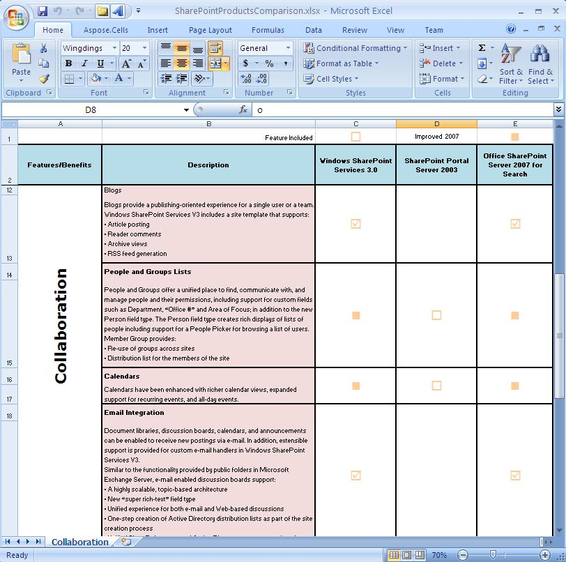
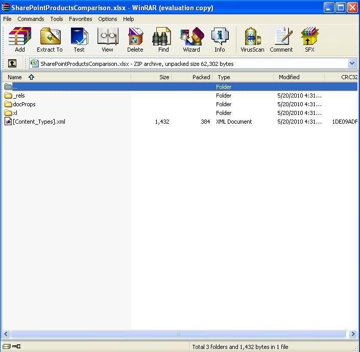

#### **About SpreadsheetML**
SpreadsheetML is a name for a family of XML-based formats for spreadsheet documents. There are several versions of SpreadsheetML:

1. SpreadsheetML version 2003 was introduced in Microsoft Word 2003. SpreadsheetML was a significant step by Microsoft towards making the document format open.
1. [Office Open XML](http://en.wikipedia.org/wiki/Office_Open_XML) (OOXML) is the new XML-based format introduced in Microsoft Office 2007 applications. Office Open XML is a container format for several specialized XML-based markup languages. SpreadsheetML version 2007 is the markup language used by Microsoft Office Excel 2007 to store its documents.
1. Microsoft Excel 2010 stores documents in the SpreadsheetML version 2010 as defined in the updated OOXML standard.
#### **SpreadsheetML in Aspose.Cells**
There are three "versions" of SpreadsheetML available:

|**SpreadsheetML “Version”**|**Applicable Standard/Specification**|**Supported in Aspose.Cells for Java**|
| :- | :- | :- |
|Microsoft Excel 2003|[Microsoft Excel 2003 XML](http://en.wikipedia.org/wiki/Microsoft_Office_XML_formats)|Yes|
|Microsoft Excel 2007|[OOXML ECMA-376](http://www.ecma-international.org/publications/standards/Ecma-376.htm)|Yes|
|Microsoft Excel 2010|OOXML ISO/IEC DIS 29500|Yes|
|Microsoft Excel 2013|OOXML ISO/IEC DIS 29500|Yes|
OOXML SpreadsheetML documents most often come as XLSX files, which are ZIP packages. In addition to XLSX. Aspose.Cells provides extensive support for loading, saving and converting SpreadsheetML documents. Such an all-embracing implementation is possible because Aspose.Cells was designed with the structure of Microsoft Excel documents in mind (and SpreadsheetML is known to mimic the internal representation of Microsoft Excel documents).

**An XLSX document generated by Aspose.Cells and opened in Microsoft Excel** 

**The XLSX document generated by Aspose.Cells follows the Open Packaging Convention and can be opened in a ZIP-capable application** 

#### **OOXML is Open, Why Use Aspose.Cells?**
It is true that Office Open XML technology makes it possible to build document processing and generating applications using just the XML classes without relying on third-party libraries such as Aspose.Cells.  However, we strongly believe it is still very beneficial to use Aspose.Cells when you have to deal with OOXML documents, rather than work through XML or other libraries.

The OOXML specification is several thousand pages long. Being open and standard does not mean being simple. To correctly process or generate OOXML documents one must invest in learning the format well.

In addition to making it simpler to correctly process and generate valid documents, Aspose.Cells provides the following important features you would not have when working with OOXML files directly via XML or other third-party libraries:

- Quality conversions between many popular Excel formats, including conversion to PDF, HTML, TIFF, and printing.
- Ability to build documents from fragments, from one or multiple documents, while automatically merging data by stylistic formatting, charts, and graphics.
- High-level functions, such as import data from different data sources including Array, ArrayList, DataTable, DataColumn, DataGrid, DataView, and DataReader or export data to fill a DataTable or an Array with just one line of code.
- Robust Formula Calculation Engine that supports almost all of the standard and advanced, Microsoft Excel Functions.

Consider the following example. Some cells contain the text “Hello World” in bold. Now imagine you need to write a program that searches for all “Hello World” phrases in the worksheet and replaces them with “Goodbye Earth”.
#### **A fragment of an Office Open XML Document**
**XML**



 <?xml version="1.0" encoding="UTF-8" standalone="yes" ?>

\- <worksheet xmlns="http://schemas.openxmlformats.org/spreadsheetml/2006/main" xmlns:r="http://schemas.openxmlformats.org/officeDocument/2006/relationships">

  <dimension ref="A1:M184" />

\- <sheetViews>

\- <sheetView tabSelected="1" workbookViewId="0">

  <selection activeCell="H27" sqref="H27" />

  </sheetView>

  </sheetViews>

  <sheetFormatPr defaultRowHeight="15" />

\- <sheetData>

\- <row r="1" spans="1:7">

\- <c r="A1" s="1" t="s">

  <v>0</v>

  </c>

  </row>

\- <row r="11" spans="1:7">

\- <c r="D11" s="1" t="s">

  <v>0</v>

  </c>

  </row>

\- <row r="15" spans="1:7">

\- <c r="G15" s="1" t="s">

  <v>0</v>

  </c>

  </row>

\- <row r="21" spans="2:7">

\- <c r="G21" s="1" t="s">

  <v>0</v>

  </c>

  </row>

\- <row r="25" spans="2:7">

\- <c r="F25" s="1" t="s">

  <v>0</v>

  </c>

  </row>

\- <row r="31" spans="2:7">

\- <c r="B31" s="1" t="s">

  <v>0</v>

  </c>

  </row>

\- <row r="34" spans="6:13">

\- <c r="M34" s="1" t="s">

  <v>0</v>

  </c>

  </row>

\- <row r="38" spans="6:13">

\- <c r="F38" s="1" t="s">

  <v>0</v>

  </c>

  </row>

\- <row r="117" spans="8:8">

\- <c r="H117" s="1" t="s">

  <v>0</v>

  </c>

  </row>

\- <row r="184" spans="8:8">

\- <c r="H184" s="1" t="s">

  <v>0</v>

  </c>

  </row>

  </sheetData>

  <pageMargins left="0.7" right="0.7" top="0.75" bottom="0.75" header="0.3" footer="0.3" />

</worksheet>



Implementing even a simple find and replace operation in an Office Open XML document is difficult.

**Our advice:** remember that open and standard does not mean simple and use Aspose.Cells.
