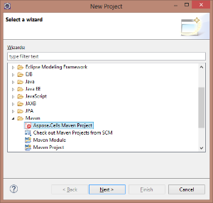
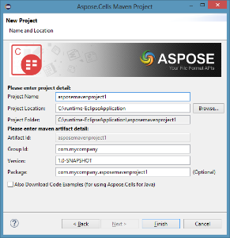
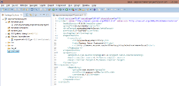
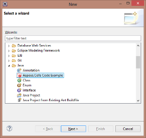
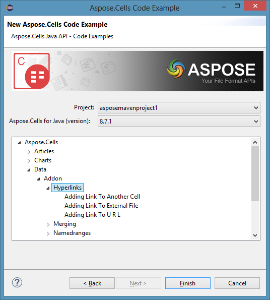
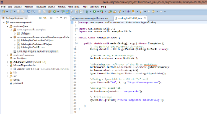

## **Installing**

**Aspose.Cells Java for Eclipse (Maven)** plugin can be easily installed from the Available **Plugin** tab in the Plugin dialog.

- To open it, select **Plugins** from the **Tools** menu in Eclipse.  

- This adds the **Aspose.Cells Maven Project** in New Project wizard and **Aspose.Cells Code Example** in New Other wizard of Eclipse IDE.  

## **Using**

### **Aspose.Cells Maven Project (wizard)**

To create **Maven Project** by wizard for using [Aspose.Cells for Java API](https://products.aspose.com/cells/java/):

1. Select **New -> Project**.
1. Select **Aspose.Cells Maven Project** in the **Maven** category.
1. Click **Next**.

1. Provide **Project Name, Location, GroupId, ArtifactId** and **Version** for your Maven Project and click **Finish.**

1. This will retrieve the [Aspose.Cells for Java](https://products.aspose.com/cells/java/) latest [Maven Dependency](https://repository.aspose.com/webapp/#/artifacts/browse/tree/General/repo/com/aspose/aspose-cells) reference from [Aspose Cloud Maven Repository](https://repository.aspose.com/webapp/#/artifacts/browse/tree/General/repo) and configure it in **pom.xml**. If you have opted for **Also Download Code Examples,** downloading of the **Code Examples** will also begin from the [Aspose.Cells for Java API Examples Repository.](https://github.com/aspose-cells/Aspose.Cells-for-Java)
1. Following **Maven** Project will be created on your **Eclipse IDE** on completion of the wizard:  

1. The created **Maven Project** is configured to use **Aspose.Cells for Java API** and ready to be enhanced as per your Project requirements.
   If you have opted to download [Code Examples](https://github.com/aspose-cells/Aspose.Cells-for-Java), you can use **Aspose.Cells Code Example (wizard)** for importing needed **Code Examples** of Aspose.Cells for Java API into your project.

### **Aspose.Cells Code Example (wizard)**

**Aspose.Cells Code Example wizard** allows you to try out many samples provided for Aspose.Cells for Java API.

{}

To be able to use **Aspose.Cells Code Example wizard** comfortably: it is recommended to always select **Also Download Code Examples** while creating **Maven Project** on **Aspose.Cells Maven Project** **wizard**,

{}

To use examples, just:

1. Click **New -> Other** in **Eclipse**.
1. Select **Aspose.Cells Code Example** in the **Java** category.
1. Click **Next**.  

1. Choose your project and then expand the tree to select **Code Example** category and click **Finish**.

1. This will copy the selected category **Code Examples** Java files into the project under **com.aspose.cells.examples** package. Also any required resources needed by the Code Examples will be copied into **src/main/resources** folder, as shown below:

1. Review the example code, compile and run.
1. You can now test other examples and start building your own application using Aspose.Cells for Java API.
