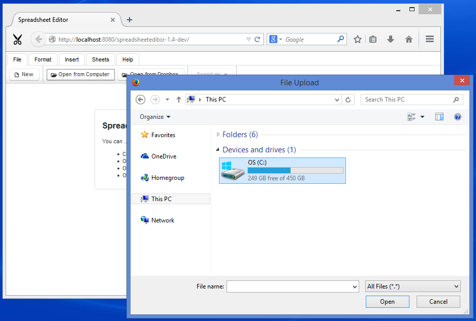
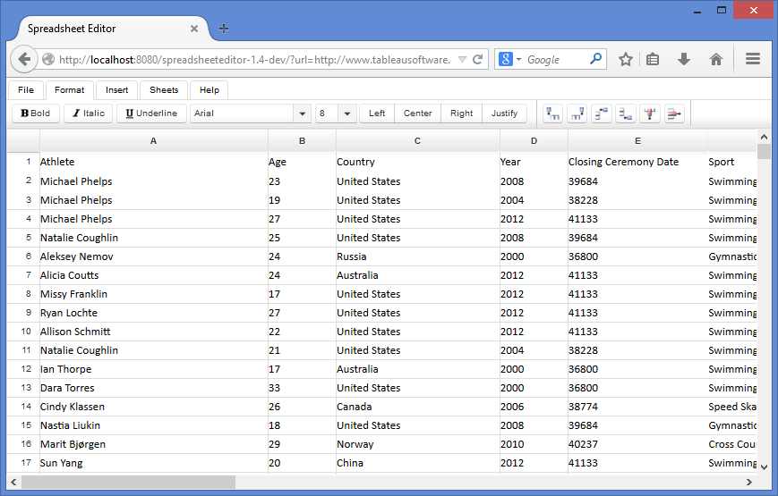
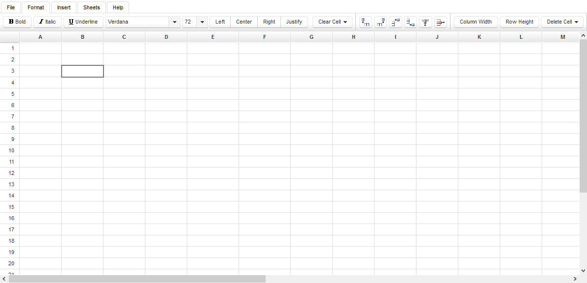

**Table of Contents**

- [Supported Files](#SpreadsheetEditor-WorkingwithFiles-SupportedFiles)
- [Open Local Files](#SpreadsheetEditor-WorkingwithFiles-OpenLocalFiles) 
  - LoaderService.buildColumnWidthCache
  - LoaderService.buildRowHeightCache
- [Open from Dropbox](#SpreadsheetEditor-WorkingwithFiles-OpenfromDropbox)
- [Open from URL](#SpreadsheetEditor-WorkingwithFiles-OpenfromURL) 
  - LoaderService.fromUrl
  - LoaderService.buildCellsCache
  - LoaderService.buildColumnWidthCache
  - LoaderService.buildRowHeightCache
- [Create a New Spreadsheet](#SpreadsheetEditor-WorkingwithFiles-CreateaNewSpreadsheet) 
  - LoaderService.fromBlank
  - buildCellsCache
  - buildColumnWidthCache
  - buildRowHeightCache
- [Export to Various Formats](#SpreadsheetEditor-WorkingwithFiles-ExporttoVariousFormats)
### **Supported Files**
HTML5 Spreadsheet Editor can open files in the following formats:

- Excel 1997-2003 XLS
- Excel 2007-2013 XLSX
- XLSM
- XLSB
- XLTX
- SpreadsheetML
- CVS
- OpenDocument
### **Open Local Files**
To upload a file from local computer:

1. Switch to **File tab** on top.
1. Click **Open from Computer** to open the Browse dialog.
1. Go to your desired location of file.
1. Click the desired file to select it.
1. Click **Open**.

The file will be opened in the editor.

**How it works?**

**File upload**

The user select a file from local computer which is uploaded from web browser to server and received by [PrimeFaces fileUpload](https://www.primefaces.org/showcase/ui/file/upload/basic.xhtml) component.



 <p:fileUpload fileUploadListener="#\{workbook.onFileUpload\}" update=":ribbon :intro :sheet" />



**Managing workbook**

As soon as the file is uploaded completely, the WorkbookService.onFileUpload method comes into action to handle the situation. WorkbookService receives events from web browser and keeps track on the state of whole workbook. The WorkbookService.onFileUpload pass on the control to LoaderService to load the workbook into memory. As the ***fileUpload*** component provides the uploaded file as an [InputStream](https://docs.oracle.com/javase/8/docs/api/index.html?java/io/InputStream.html), the LoaderService loads it using LoaderService.fromInputStream method.



 public void onFileUpload(FileUploadEvent e) {

    this.current = loader.fromInputStream(e.getFile().getInputstream(), e.getFile().getFileName());

}



**Loading and unloading**

The method ***LoaderService.fromInputStream*** reads the ***InputStream*** provided by fileUpload ***component*** create instance of ***com.aspose.cells.Workbook*** class. This instance is kept in memory as long the user keeps viewing or editing the spreadsheet in web browser. When user leaves the editor or close the browser the unused instances are automatically unloaded from memory to keep the server clean.



 public String fromInputStream(InputStream s, String name) {

    com.aspose.cells.Workbook w;

    try (InputStream i = s) {

        w = new com.aspose.cells.Workbook(i);

    } catch (Exception x) {

        return null;

    }

    String key = this.generateKey();

    this.workbooks.put(key, w);

    this.buildCellsCache(key);

    this.buildColumnWidthCache(key);

    this.buildRowHeightCache(key);

    return key;

}



**Caching**

Caching is very important to HTML5 Spreadsheet Editor. It makes everything work smooth. The CellsService keep cache rows, columns, cells and properties of all workbooks loaded by the editor. When LoaderService loads a spreadsheet completely, it reads the it from top to bottom and fills up the cache by calling LoaderService.buildCellsCache, LoaderService.buildColumnWidthCache, LoaderService.buildRowHeightCache



     public void buildCellsCache(String key) {

        com.aspose.cells.Workbook wb = workbooks.get(key);

        com.aspose.cells.Worksheet ws = wb.getWorksheets().get(wb.getWorksheets().getActiveSheetIndex());

        int maxColumn = ws.getCells().getMaxColumn() + 1;

        maxColumn = maxColumn + 26 - (maxColumn % 26);

        int maxRow = 20 + ws.getCells().getMaxRow() + 1;

        maxRow = maxRow + 10 - (maxRow % 10);

        ArrayList<Column> columns = new ArrayList<>(maxColumn);

        ArrayList<Row> rows = new ArrayList<>(maxRow);

        for (int i = 0; i < maxColumn; i++) {

            columns.add(i, new Column(i, com.aspose.cells.CellsHelper.columnIndexToName(i)));

        }

        for (int i = 0; i < maxRow; i++) {

            rows.add(i, new Row.Builder().setId(i).build());

        }

        for (Object o : ws.getCells()) {

            com.aspose.cells.Cell c = (com.aspose.cells.Cell) o;

            rows.get(c.getRow()).putCell(c.getColumn(), cells.fromAsposeCell(c));

        }

        for (int i = 0; i < maxRow; i++) {

            for (int j = 0; j < maxColumn; j++) {

                String col = com.aspose.cells.CellsHelper.columnIndexToName(j);

                if (!rows.get(i).getCellsMap().containsKey(col)) {

                    rows.get(i).putCell(col, cells.fromBlank(j, i));

                }

            }

        }

        cells.putColumns(key, columns);

        cells.putRows(key, rows);

    }



#### **LoaderService.buildColumnWidthCache**


     public void buildColumnWidthCache(String key) {

        com.aspose.cells.Workbook wb = workbooks.get(key);

        com.aspose.cells.Worksheet ws = wb.getWorksheets().get(wb.getWorksheets().getActiveSheetIndex());

        ArrayList<Integer> columnWidth = new ArrayList<>();

        for (int i = 0; i < cells.getColumns(key).size(); i++) {

            columnWidth.add(i, ws.getCells().getColumnWidthPixel(i));

        }

        cells.putColumnWidth(key, columnWidth);

    }



#### **LoaderService.buildRowHeightCache**


     public void buildRowHeightCache(String key) {

        com.aspose.cells.Workbook wb = workbooks.get(key);

        com.aspose.cells.Worksheet ws = wb.getWorksheets().get(wb.getWorksheets().getActiveSheetIndex());

        ArrayList<Integer> rowHeight = new ArrayList<>();

        for (int i = 0; i < cells.getRows(key).size(); i++) {

            rowHeight.add(i, ws.getCells().getRowHeightPixel(i));

        }

        cells.putRowHeight(key, rowHeight);

    }



### **Open from Dropbox**
To open files from Dropbox:

1. Switch to **File tab** on top.
1. Click **Open from Dropbox** to open Dropbox file chooser.
1. If you are not already signed-in, it will require you to sign-in to your Dropbox account.
1. Navigate to desired file and click to select it.
1. Click **Choose** at the bottom.

Your selected file will be opened from Dropbox.

**How it works?**

The **Open from Dropbox** button uses **Dropbox JavaScript Chooser API** to open Dropbox Chooser dialog. The Chooser provides URL of selected file, which is captured by the callback function and sent back to the server. The server creates a instance of spreadsheet from URL, initialize some housekeeping stuff, and send DOM updates back to the browser. The browser renders and refresh the HTML and user is ready to edit the loaded document.
### **Open from URL**
Files can be directly opened from URLs. This allows user to edit any publicly available file on Internet. To open the file append **?url=location** parameter with the value of your desired **location** while loading the editor. For example:



 http://editor.aspose.com/?url=http://example.com/Sample.xlsx



**How it works?**

**Instantiate during startup**

When **WorksheetView** backend bean is instantiated by JSF the **PostConstruct** method **init** is called which loads the spreadsheet using LoaderService.fromUrl.

**Caching**

Caching occurs right after the spreadsheet is loaded. The **LoaderService** calls **LoaderService.buildCellsCache**, **LoaderService.buildColumnWidthCache** and **LoaderService.buildRowHeightCache** one-by-one to cache content of the spreadsheet and keep all operations fast and smooth.

**DOM updates**

When spreadsheet is ready at server side, JSF components are used to generate new HTML and send DOM updates to user which are rendered by the web browser.



     @PostConstruct

    private void init() {

        String requestedSourceUrl = FacesContext.getCurrentInstance().getExternalContext().getRequestParameterMap().get("url");

        if (requestedSourceUrl != null) {

            try {

                this.sourceUrl = new URL(requestedSourceUrl).toString();

                this.loadFromUrl();

            } catch (MalformedURLException x) {

                msg.sendMessageDialog("The specified URL is invalid", requestedSourceUrl);

            }

        }

    }



#### **LoaderService.fromUrl**


     public String fromUrl(String url) {

        com.aspose.cells.Workbook w;

        try (InputStream i = new URL(url).openStream()) {

            w = new com.aspose.cells.Workbook(i);

        } catch (Exception x) {

            throw new RuntimeException(x);

        }

        String key = generateKey();

        workbooks.put(key, w);

        buildCellsCache(key);

        buildColumnWidthCache(key);

        buildRowHeightCache(key);

        return key;

    }



#### **LoaderService.buildCellsCache**


     public void buildCellsCache(String key) {

        com.aspose.cells.Workbook wb = workbooks.get(key);

        com.aspose.cells.Worksheet ws = wb.getWorksheets().get(wb.getWorksheets().getActiveSheetIndex());

        int maxColumn = ws.getCells().getMaxColumn() + 1;

        maxColumn = maxColumn + 26 - (maxColumn % 26);

        int maxRow = 20 + ws.getCells().getMaxRow() + 1;

        maxRow = maxRow + 10 - (maxRow % 10);

        ArrayList<Column> columns = new ArrayList<>(maxColumn);

        ArrayList<Row> rows = new ArrayList<>(maxRow);

        for (int i = 0; i < maxColumn; i++) {

            columns.add(i, new Column(i, com.aspose.cells.CellsHelper.columnIndexToName(i)));

        }

        for (int i = 0; i < maxRow; i++) {

            rows.add(i, new Row.Builder().setId(i).build());

        }

        for (Object o : ws.getCells()) {

            com.aspose.cells.Cell c = (com.aspose.cells.Cell) o;

            rows.get(c.getRow()).putCell(c.getColumn(), cells.fromAsposeCell(c));

        }

        for (int i = 0; i < maxRow; i++) {

            for (int j = 0; j < maxColumn; j++) {

                String col = com.aspose.cells.CellsHelper.columnIndexToName(j);

                if (!rows.get(i).getCellsMap().containsKey(col)) {

                    rows.get(i).putCell(col, cells.fromBlank(j, i));

                }

            }

        }

        cells.putColumns(key, columns);

        cells.putRows(key, rows);

    }



#### **LoaderService.buildColumnWidthCache**


     public void buildColumnWidthCache(String key) {

        com.aspose.cells.Workbook wb = workbooks.get(key);

        com.aspose.cells.Worksheet ws = wb.getWorksheets().get(wb.getWorksheets().getActiveSheetIndex());

        ArrayList<Integer> columnWidth = new ArrayList<>();

        for (int i = 0; i < cells.getColumns(key).size(); i++) {

            columnWidth.add(i, ws.getCells().getColumnWidthPixel(i));

        }

        cells.putColumnWidth(key, columnWidth);

    }



#### **LoaderService.buildRowHeightCache**


     public void buildRowHeightCache(String key) {

        com.aspose.cells.Workbook wb = workbooks.get(key);

        com.aspose.cells.Worksheet ws = wb.getWorksheets().get(wb.getWorksheets().getActiveSheetIndex());

        ArrayList<Integer> rowHeight = new ArrayList<>();

        for (int i = 0; i < cells.getRows(key).size(); i++) {

            rowHeight.add(i, ws.getCells().getRowHeightPixel(i));

        }

        cells.putRowHeight(key, rowHeight);

    }



### **Create a New Spreadsheet**
To create a new empty spreadsheet:

1. Switch to **File tab**.
1. Click the **New** button.

The editor will close the opened spreadsheet, if any, and will open a new one.

**How it works?**

**Instantiate a new object**

When the **New** button is clicked by the user, **WorksheetView.loadBlank**, which eventually calls **LoaderService.fromBlank**. LoaderService creates a new instance of blank spreadsheet.

**Caching**

Caching occurs right after the spreadsheet is loaded. The **LoaderService** calls **LoaderService.buildCellsCache**, **LoaderService.buildColumnWidthCache** and **LoaderService.buildRowHeightCache** one-by-one to cache content of the spreadsheet and keep all operations fast and smooth.

**DOM updates**

When spreadsheet is ready at server side, JSF components are used to generate new HTML and send DOM updates to user which are rendered by the web browser.



     public void loadBlank() {

        this.loadedWorkbook = loader.fromBlank();

    }



#### **LoaderService.fromBlank**


     public String fromBlank() {

        com.aspose.cells.Workbook w = new com.aspose.cells.Workbook();

        String key = generateKey();

        workbooks.put(key, w);

        buildCellsCache(key);

        buildColumnWidthCache(key);

        buildRowHeightCache(key);

        return key;

    }



#### **buildCellsCache**


     public void buildCellsCache(String key) {

        com.aspose.cells.Workbook wb = workbooks.get(key);

        com.aspose.cells.Worksheet ws = wb.getWorksheets().get(wb.getWorksheets().getActiveSheetIndex());

        int maxColumn = ws.getCells().getMaxColumn() + 1;

        maxColumn = maxColumn + 26 - (maxColumn % 26);

        int maxRow = 20 + ws.getCells().getMaxRow() + 1;

        maxRow = maxRow + 10 - (maxRow % 10);

        ArrayList<Column> columns = new ArrayList<>(maxColumn);

        ArrayList<Row> rows = new ArrayList<>(maxRow);

        for (int i = 0; i < maxColumn; i++) {

            columns.add(i, new Column(i, com.aspose.cells.CellsHelper.columnIndexToName(i)));

        }

        for (int i = 0; i < maxRow; i++) {

            rows.add(i, new Row.Builder().setId(i).build());

        }

        for (Object o : ws.getCells()) {

            com.aspose.cells.Cell c = (com.aspose.cells.Cell) o;

            rows.get(c.getRow()).putCell(c.getColumn(), cells.fromAsposeCell(c));

        }

        for (int i = 0; i < maxRow; i++) {

            for (int j = 0; j < maxColumn; j++) {

                String col = com.aspose.cells.CellsHelper.columnIndexToName(j);

                if (!rows.get(i).getCellsMap().containsKey(col)) {

                    rows.get(i).putCell(col, cells.fromBlank(j, i));

                }

            }

        }

        cells.putColumns(key, columns);

        cells.putRows(key, rows);

    }



#### **buildColumnWidthCache**


     public void buildColumnWidthCache(String key) {

        com.aspose.cells.Workbook wb = workbooks.get(key);

        com.aspose.cells.Worksheet ws = wb.getWorksheets().get(wb.getWorksheets().getActiveSheetIndex());

        ArrayList<Integer> columnWidth = new ArrayList<>();

        for (int i = 0; i < cells.getColumns(key).size(); i++) {

            columnWidth.add(i, ws.getCells().getColumnWidthPixel(i));

        }

        cells.putColumnWidth(key, columnWidth);

    }



#### **buildRowHeightCache**


     public void buildRowHeightCache(String key) {

        com.aspose.cells.Workbook wb = workbooks.get(key);

        com.aspose.cells.Worksheet ws = wb.getWorksheets().get(wb.getWorksheets().getActiveSheetIndex());

        ArrayList<Integer> rowHeight = new ArrayList<>();

        for (int i = 0; i < cells.getRows(key).size(); i++) {

            rowHeight.add(i, ws.getCells().getRowHeightPixel(i));

        }

        cells.putRowHeight(key, rowHeight);

    }



### **Export to Various Formats**
After editing files, the user will want to save changes. The editor allows user to export and download the modified spreadsheet to local computer. To export the file:

1. Switch to **File tab** on top.
1. Click **Export** as button.
1. Choose your desired format from the dropdown.

The modified file will be exported for download. The following formats are supported for export:

- Excel 2007-2013 XLSX
- Excel 1997-2003 XLS
- Excel XLSM
- Excel XLSB
- Excel XLTX
- Excel XLTM
- SpreadsheetML
- Portable Document Format (PDF)
- OpenDocument Spreadsheet (ODS)

**How it works?**

The opened spreadsheet is converted to user-specified format using **WorksheetView.getOutputFile**.



     public StreamedContent getOutputFile(int saveFormat) {

        byte[] buf;

        String ext = null;

        switch (saveFormat) {

            case com.aspose.cells.SaveFormat.EXCEL_97_TO_2003:

                ext = "xls";

                break;

            case com.aspose.cells.SaveFormat.XLSX:

                ext = "xlsx";

                break;

            case com.aspose.cells.SaveFormat.XLSM:

                ext = "xlsm";

                break;

            case com.aspose.cells.SaveFormat.XLSB:

                ext = "xlsb";

                break;

            case com.aspose.cells.SaveFormat.XLTX:

                ext = "xltx";

                break;

            case com.aspose.cells.SaveFormat.XLTM:

                ext = "xltm";

                break;

            case com.aspose.cells.SaveFormat.SPREADSHEET_ML:

                ext = "xml";

                break;

            case com.aspose.cells.SaveFormat.PDF:

                ext = "pdf";

                break;

            case com.aspose.cells.SaveFormat.ODS:

                ext = "ods";

                break;

        }

        try {

            ByteArrayOutputStream out = new ByteArrayOutputStream();

            getAsposeWorkbook().save(out, saveFormat);

            buf = out.toByteArray();

        } catch (Exception x) {

            throw new RuntimeException(x);

        }

        return new DefaultStreamedContent(new ByteArrayInputStream(buf), "application/octet-stream", "Spreadsheet." + ext);

    }



