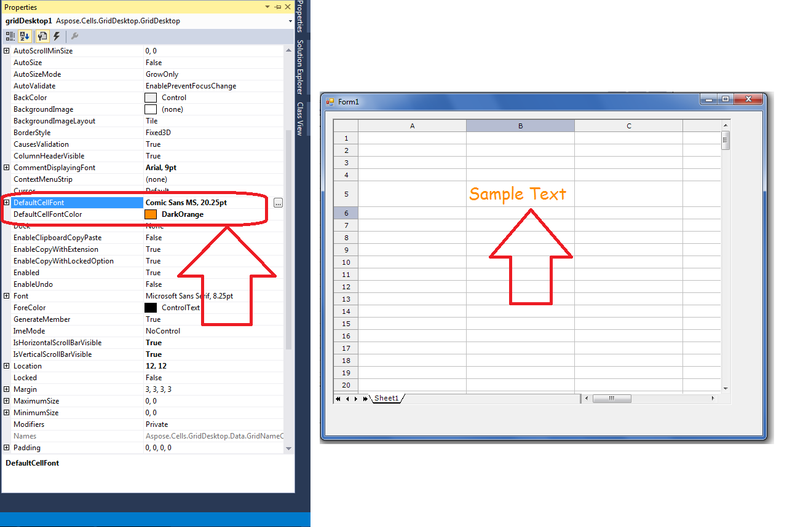

## **Possible Usage Scenarios**
Sometimes, you want to change the default font and font color of the GridDesktop. Please use the following two properties for this purpose. You can access these properties at Design Time or at Runtime depending upon your needs.

- GridDesktop.DefaultCellFont
- GridDesktop.DefaultCellFontColor
## **Change Default Font and Font Color at Design Time**
The following screenshot shows how to change the default font and font color of GridDesktop at Design Time.

## **Change Default Font and Font Color at Run Time**
The following sample code explains how to change the default font and font color of GridDesktop at Run Time.



 //Assign your desired Font object to DefaultCellFont property

System.Drawing.Font fnt = new System.Drawing.Font("Arial Black", 18);

this.gridDesktop1.DefaultCellFont = fnt;

//Assign your desired Font color to DefaultCellFontColor property

this.gridDesktop1.DefaultCellFontColor = System.Drawing.Color.Blue;


