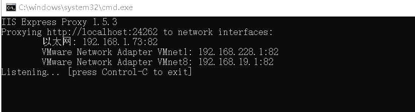
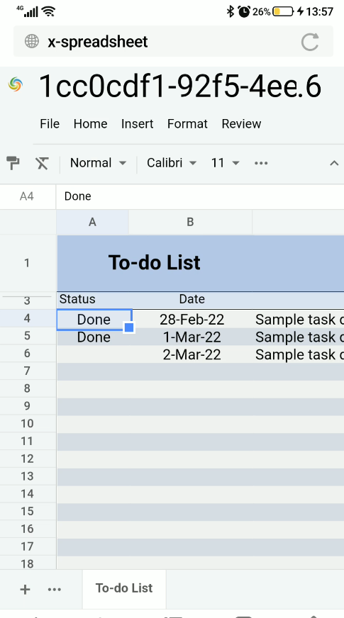

## Use GridJs in mobile device

You can use GridJs smoothly on the mobile device. 

GridJs can adapts the mobile screen.

Run the [demo of GridJs ](https://github.com/aspose-cells/Aspose.Cells-for-.NET/tree/master/Examples_GridJs "demo of GridJs ")

The default port of the demo project is 24262. 

You need to access the page through IP way on the mobile terminal http://localhost:24262/GridJs2/List . 

You can use a small tool like: iisexpress proxy.

Install with the following command:

*npm install -g iisexpress-proxy *

Run the command to complete the port mapping:

*iisexpress-proxy 24262 to 82*

Then  we can open the demo web page in the mobile browser.

Navigate the page http://yourip:82/GridJs2/List  and select a file to open.

Then we can do edit operations as in PC device.