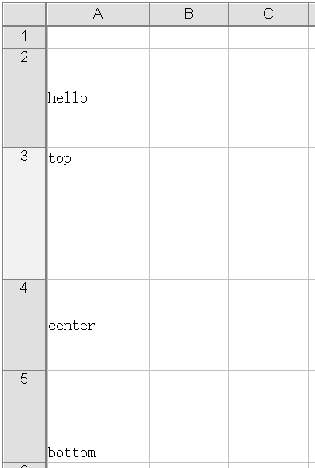
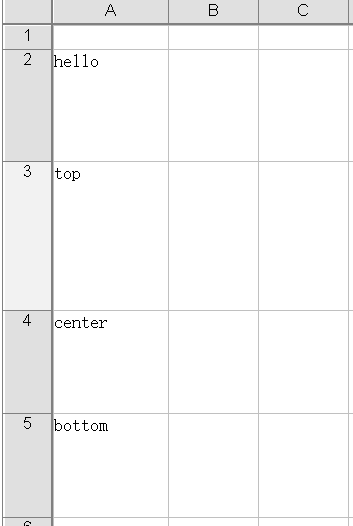
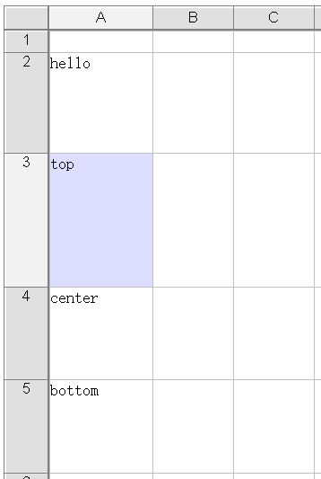

{} 

Developers can set diffrent initialization parameter value to perform diffrent behavior for the Aspose.Cells.GridWeb control in acwmain.js.  

{} 
 
### **Parameters**
 
|**Parameter**|**Description**|
| :- | :- |
|needInitAlignmentAdjust| whether to do vertical alignment for cell content at initalization,it will cause some time to do the alignment work ,if the worksheet has large cells,the performance will be poor,if user do not care the vertical alignment,then he can set it to be false,the default value is true |
|focusinside|  whether to focus inside the cell span,the default value is true |
|copy_with_style| whether to copy with style,the default value is false which means only copy cell content|
|useESCAsLeave| the default behavior when press esc works as cancel edit operation on cell,  if we set this value to true, we will just treat it as a short key to leave cell without changing back to previous value,and it will also change the inside edit way to fast edit way ,the default value is false|
|needValidateall| whether   to validate all the validations on the active sheet  when do validation,(in aspx control page set ForceValidation="True") . the default value is false|
|scrollToInvalidate|whether to scroll and bring the first invalidate cell into view when needValidateall set to true.the default value is true.|
 
 
The output of the code example is shown below,Please check the [sample excel file](valign.xlsx):

**needInitAlignmentAdjust=true** 

**needInitAlignmentAdjust=false** 

**focusinside=true** 
inside edit way -- when enter text,the old cell value will still keep   

**focusinside=false** 
fast edit way -- when enter text,the old cell value will be overwritten,if you want to edit based on the old cell value,you can click on the cell

 
 