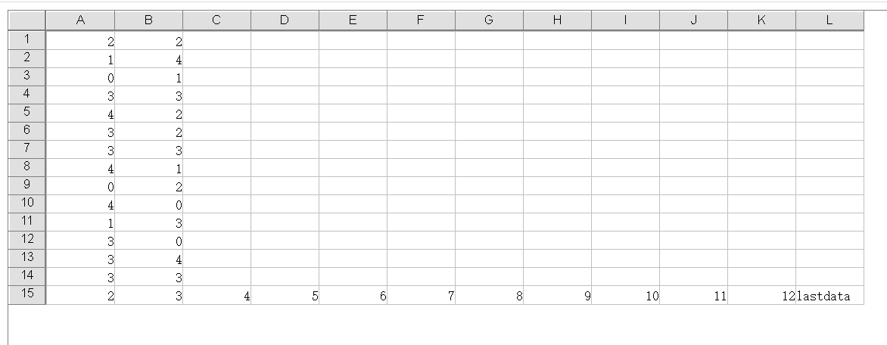
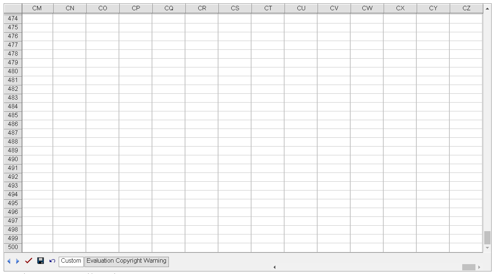

## **Possible Usage Scenarios**
Please use [GridWeb.IgnoreStyleWithNoData](https://apireference.aspose.com/cells/net/aspose.cells.gridweb/gridweb/properties/ignorestylewithnodata) property while load less rows/columns from the workbook.
 
## **Filter data while Loading Workbook**
Please check the [sample excel file](largerowswithstyle.xlsx) 

When set  IgnoreStyleWithNoData = true;

As you can see ,It shows rows (to 15) and columns (to L),It will not display the last continus rows and columns without data in cells.Thus the load time will be less.

When set  IgnoreStyleWithNoData = false;(the default value is false)

As you can see ,It shows much more rows (to 500) and columns (to CZ)

 
 
 