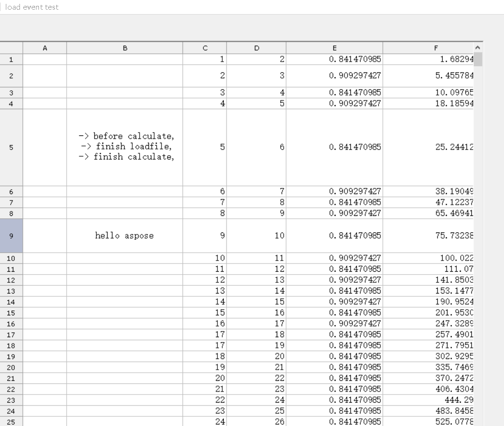

 
## **Filter data while Loading Workbook**
The following sample code illustrates how to use kinds of loading event for the workbook. Please check the [sample excel file](loading-event.xlsx) . 

The file is password protected, first we try open as a wrong password,then finally in FailLoadFile event ,we use a correct password to open it.

### **Sample Code**

 