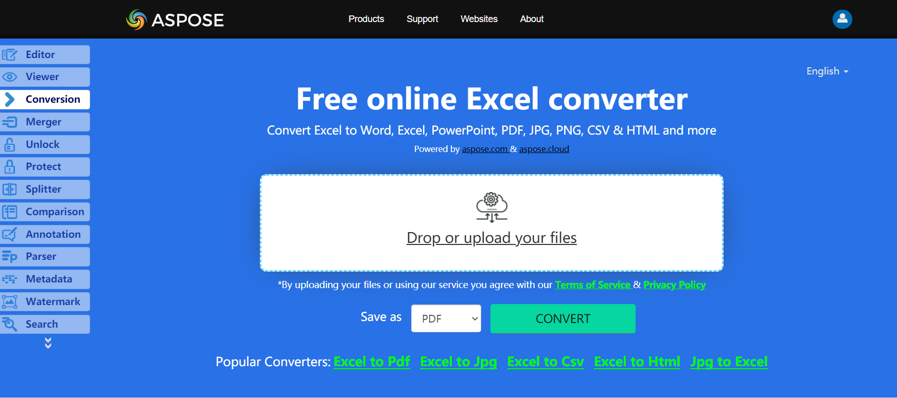

No need to wonder how to convert BMP to Excel, because Apose.Cells for .NET library has best decision.

## **Live Example**
Aspose.Cells for .NET presents you online free application [“Convert BMP to Excel”](https://products.aspose.app/cells/conversion), where you may try to investigate the functionality and quality it works.

## **Convert BMP to Excel using C#**
The code snippet below shows how to convert BMP Image to Excel using C#:

