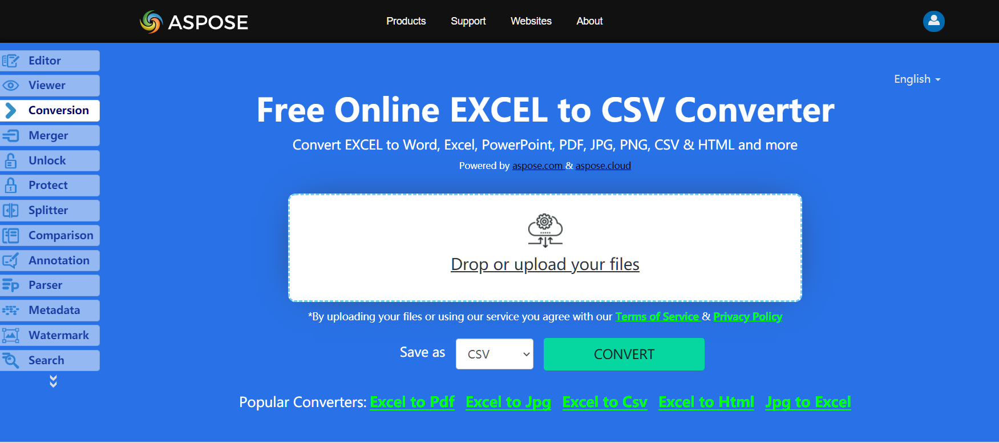

The following code example explains how to save an entire workbook into text format. Load the source workbook which could be any Microsoft Excel or OpenOffice spreadsheet file (so XLS, XLSX, XLSM, XLSB, ODS and so on) with any number of worksheets. When the code is executed, it converts the data of all sheets in the workbook to TXT format.You can modify the same example to save your file to CSV. 

## **Live Example**
Aspose.Cells for .NET presents you online free application [“Convert Excel to CSV”](https://products.aspose.app/cells/conversion/excel-to-csv), where you may try to investigate the functionality and quality it works.

## **Converting Excel Workbook to CSV**

The code snippet below shows how to convert Workbook to CSV using C#:

