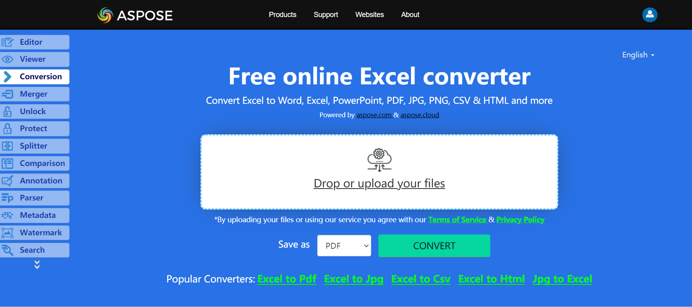

In order to convert XLSX to DIF, we’ll use Aspose.Cells API which is a feature-rich, powerful and easy to use document manipulation and conversion API.

## **Live Example**
Aspose.Cells for .NET presents you online free application [“Convert Excel to DIF”](https://products.aspose.app/cells/conversion), where you may try to investigate the functionality and quality it works.

## **Converting Excel Workbook to DIF**
The code example below shows how to save a workbook as an DIF file using C#:

