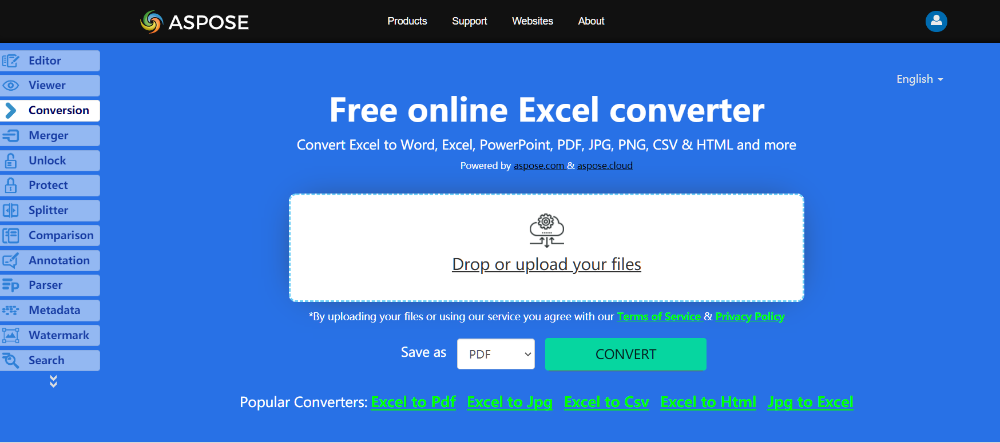

The SheetRender class allows you to convert Excel pages to EMF images. This class provides a method named ToImage which allows you to convert a particular page of the Excel file to EMF image format with C#.

## **Live Example**
Aspose.Cells for .NET presents you online free application [“Convert Excel to EMF”](https://products.aspose.app/cells/conversion), where you may try to investigate the functionality and quality it works.

## **Convert Excel to EMF images**
The code snippet below shows how to convert Excel to EMF using C#:



## **Convert Worksheet to EMF image**
The code snippet below shows how to convert Worksheet to EMF using C#:

