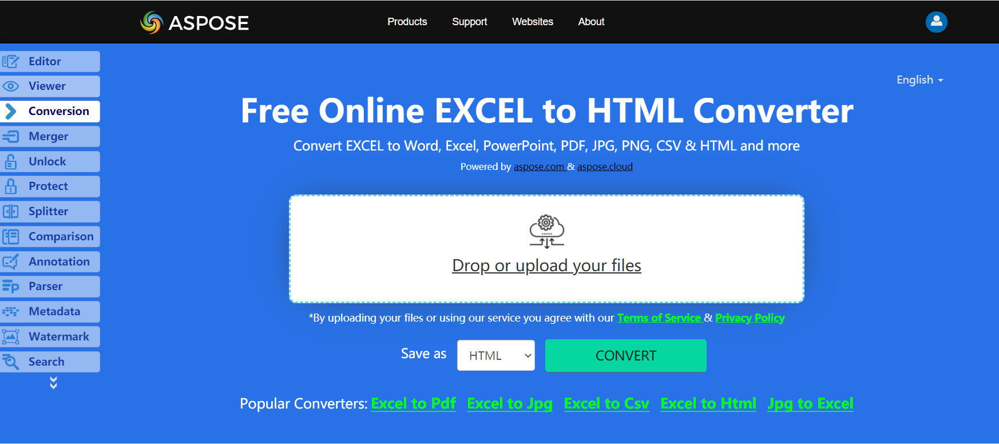

The Aspose.Cells API provides support for exporting spreadsheets to HTML format. For this purpose, Aspose.Cells uses the **[HtmlSaveOptions](https://apireference.aspose.com/cells/net/aspose.cells/htmlsaveoptions)** class to provide the flexibility to control several aspects of the output HTML.

## **Live Example**
Aspose.Cells for .NET presents you online free application [“Convert Excel to HTML”](https://products.aspose.app/cells/conversion/excel-to-html), where you may try to investigate the functionality and quality it works.

## **Converting Excel Workbook to HTML**
The code example below shows how to save a workbook as an HTML file using C#:

