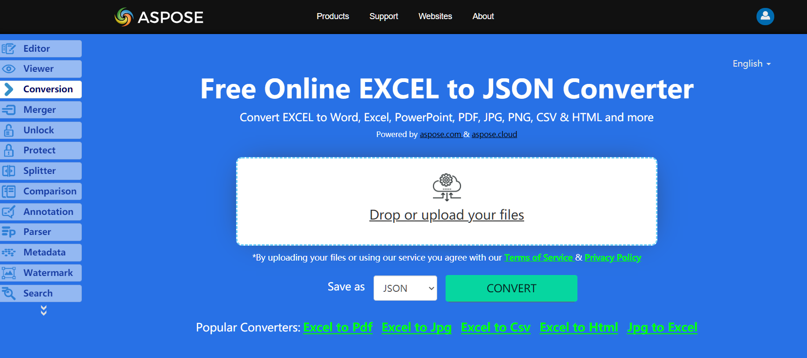

The following code example explains how to save a range into JSON format. Load the source workbook which could be any Microsoft Excel or OpenOffice spreadsheet file (so XLS, XLSX, XLSM, XLSB, ODS and so on) with any number of worksheets.You can modify the same example to save your file to JSON.

## **Live Example**
Aspose.Cells for .NET presents you online free application [“Convert Excel to JSON”](https://products.aspose.app/cells/conversion/excel-to-json), where you may try to investigate the functionality and quality it works.

## **Converting Excel to JSON**

The code snippet below shows how to convert a range to JSON using C#:

