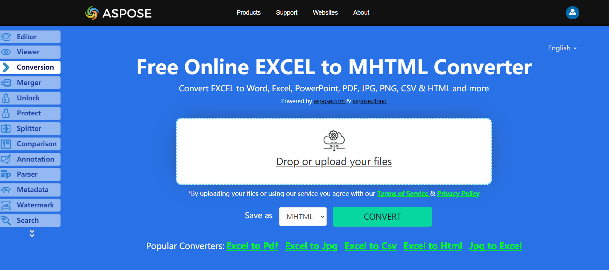

MHTML combines normal HTML with external resources (that is, content that is usually linked in, like images, animations, audio, and so on) into one file. They are used for emails with the .mht file extension.Aspose.Cells supports reading and writing MHTML files.

## **Live Example**
Aspose.Cells for .NET presents you online free application [“Convert Excel to MHTML”](https://products.aspose.app/cells/conversion/excel-to-mhtml), where you may try to investigate the functionality and quality it works.

## **Converting Excel Workbook to MHTML Files**
The code example below shows how to save a workbook as an MHTML file using C#:

