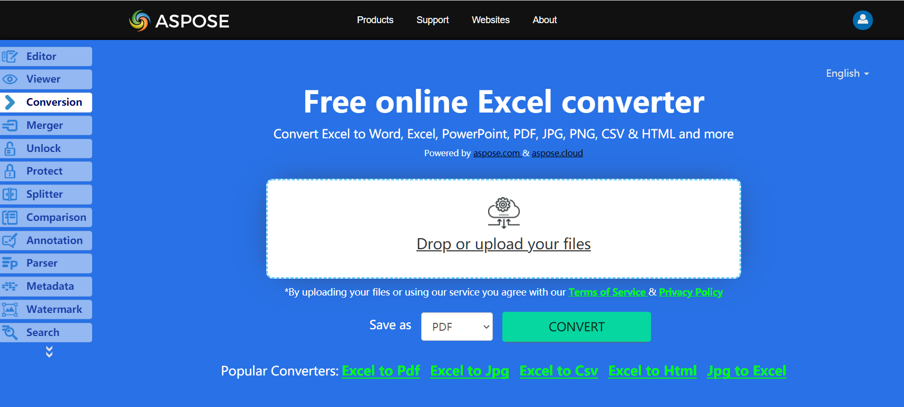

Numbers represents table data file format(.numbers) on iOS, iPadOS, and macOS. No need to wonder how to convert Excel to Numbers, because Apose.Cells for .NET library has best decision.

## **Live Example**
Aspose.Cells for .NET presents you online free application [“Convert Excel to Numbers”](https://products.aspose.app/cells/conversion), where you may try to investigate the functionality and quality it works.

## **Converting Excel to Numbers**

The code snippet below shows how to convert Workbook to Numbers format using C#:

