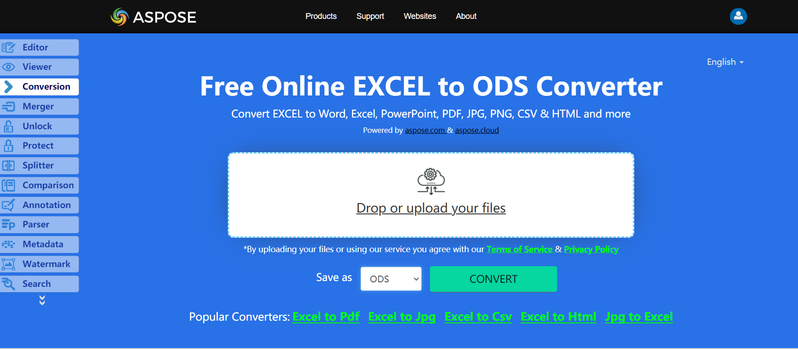

Aspose.Cells supports saving an ODS file (**OpenDocument Spreadsheet**) in the ODF (**OpenDocument Format**) 1.1 and 1.2 specifications. Aspose.Cells has [**OdsSaveOptions.IsStrictSchema11**](https://apireference.aspose.com/cells/net/aspose.cells/odssaveoptions/properties/isstrictschema11) property that specifies the use of ODF 1.1 specification for saving ODS files. The default value of this property is **false**, so the ODS file saved without this setting uses the 1.2 specifications.

## **Live Example**
Aspose.Cells for .NET presents you online free application [“Convert Excel to ODS”](https://products.aspose.app/cells/conversion/excel-to-ods), where you may try to investigate the functionality and quality it works.

## **Converting Excel Workbook to ODS**

The sample code below creates a workbook object, adds some value to cell A1 on the first worksheet and then saves the ODS file in ODF 1.1 and 1.2 specifications. By default, the ODS file is saved in ODF 1.2 specification.

