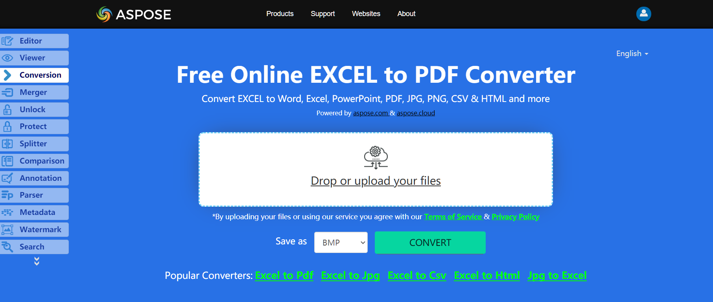

PDF files are widely used to exchange documents between organizations, government sectors, and individuals. It is a standard document format and software developers are often asked to find a way to convert Microsoft Excel files into PDF documents.

Aspose.Cells supports converting Excel files to PDF and maintains high visual fidelity in the conversion.

## **Live Example**
Aspose.Cells for .NET presents you online free application [“Convert Excel to PDF”](https://products.aspose.app/cells/conversion/excel-to-pdf), where you may try to investigate the functionality and quality it works.

## **Convert Excel to PDF using C#**
The code snippet below shows how to convert Excel to PDF using C#:

