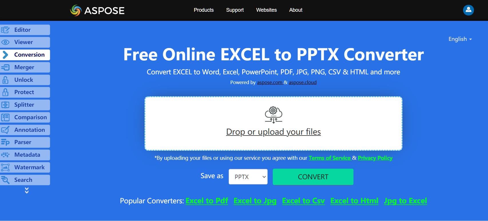

The Aspose.Cells API provides support for converting spreadsheets to PPTX format. To export the workbook to PPTX, pass [**SaveFormat.Pptx**](https://apireference.aspose.com/cells/net/aspose.cells/saveformat) as the second parameter of [**Workbook.Save**](https://apireference.aspose.com/cells/net/aspose.cells.workbook/save/methods/3) method. You may also use [**PptxSaveOptions**](https://apireference.aspose.com/cells/net/aspose.cells/pptxsaveoptions) class to specify additional settings for exporting worksheet to PPTX.

## **Live Example**
Aspose.Cells for .NET presents you online free application [“Convert Excel to PPTX”](https://products.aspose.app/cells/conversion/excel-to-pptx), where you may try to investigate the functionality and quality it works.

## **Convert Excel Workbook to PPTX**
The following code example demonstrates exporting active worksheet to PPTX by using [**SaveFormat.Pptx**](https://apireference.aspose.com/cells/net/aspose.cells/saveformat) enumeration member.

