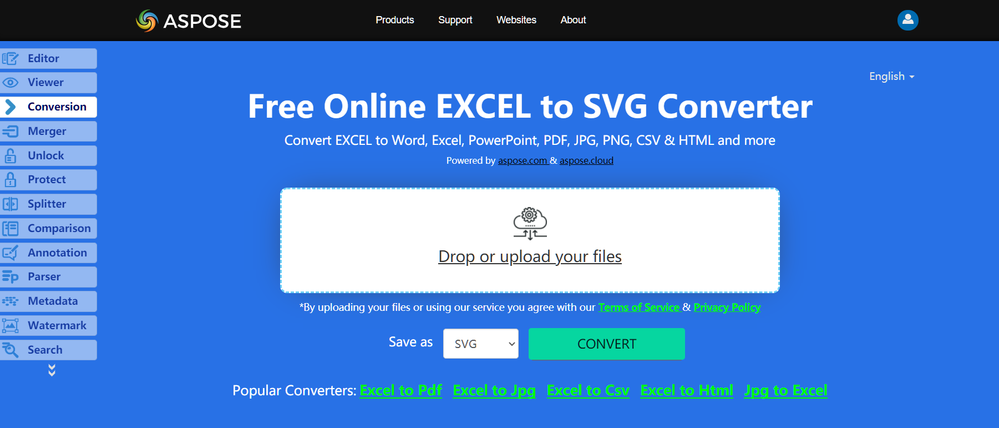

The SheetRender class allows you to convert Excel pages to SVG images. This class provides a method named ToImage which allows you to convert a particular page of the Excel file to SVG image format with C#.

## **Live Example**
Aspose.Cells for .NET presents you online free application [“Convert Excel to SVG”](https://products.aspose.app/cells/conversion/excel-to-svg), where you may try to investigate the functionality and quality it works.

## **Convert single Excel page to SVG image**
The code snippet below shows how to convert Excel to SVG using C#:

