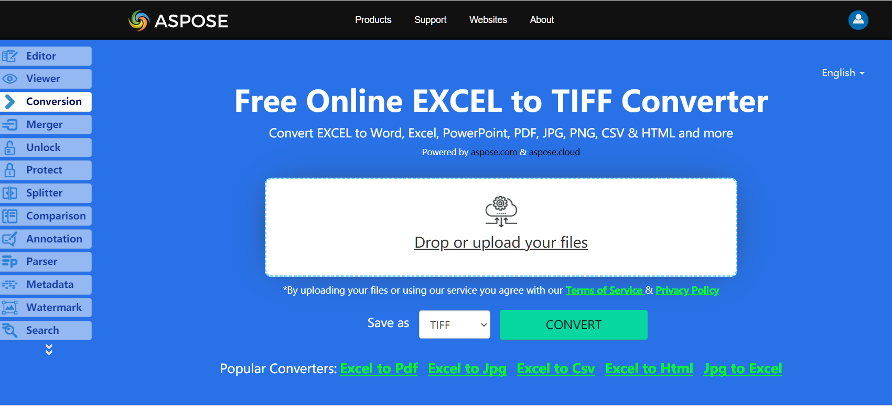

The SheetRender class allows you to convert Excel pages to TIFF images. This class provides a method named ToImage which allows you to convert a particular page of the Excel file to TIFF image format with C#.

## **Live Example**
Aspose.Cells for .NET presents you online free application [“Convert Excel to TIFF”](https://products.aspose.app/cells/conversion/excel-to-tiff), where you may try to investigate the functionality and quality it works.

## **Convert Excel to TIFF image**
The code snippet below shows how to convert Excel to TIFF using C#:

