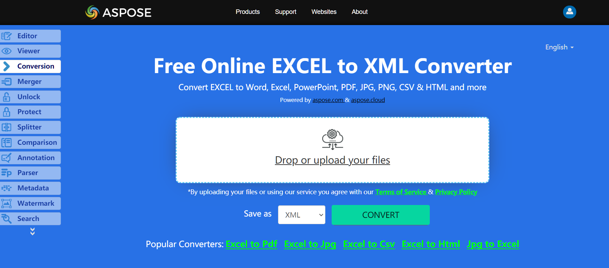

No need to wonder how to convert Excel to XML, because Apose.Cells for .NET library has best decision.

## **Live Example**
Aspose.Cells for .NET presents you online free application [“Convert Excel to XML”](https://products.aspose.app/cells/conversion/excel-to-xml), where you may try to investigate the functionality and quality it works.

## **Converting Excel to XML**

The code snippet below shows how to convert Workbook to XML format using C#:

