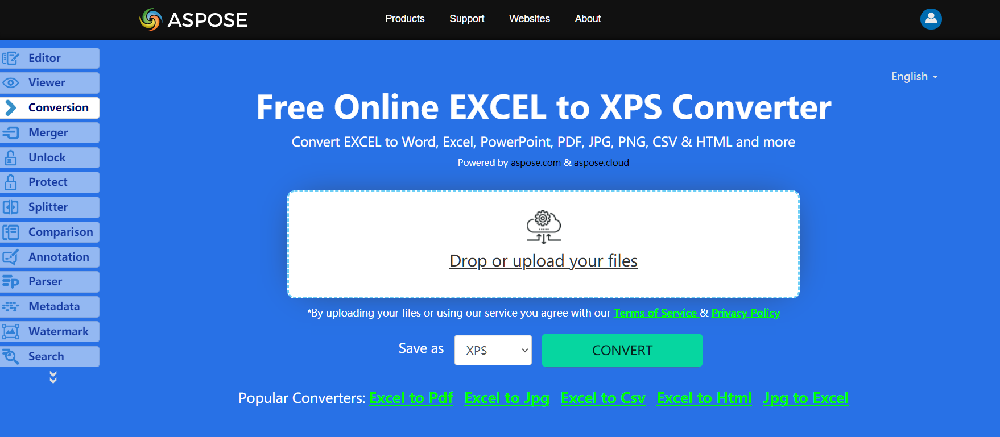

The XPS document format consists of structured XML markup that defines the layout of a document and the visual appearance of each page, along with rendering rules for distributing, archiving, rendering, processing, and printing documents.

The markup language for XPS is a subset of XAML which allows it to incorporate vector graphics elements in documents, using XAML to mark up the Windows Presentation Foundation (WPF) primitives. The elements used are described in terms of paths and other geometrical primitives.

An XPS file is, in fact, a unicode ZIP archive using the Open Packaging Conventions, containing the files which make up the document. These include an XML markup file for each page, text, embedded fonts, raster images, 2D vector graphics, as well as the digital rights management information. The contents of an XPS file can be examined simply by opening it in an application that supports ZIP files.

From Aspose.Cells 6.0.0, Microsoft Excel to XPS conversion is supported.

## **Live Example**
Aspose.Cells for .NET presents you online free application [“Convert Excel to XPS”](https://products.aspose.app/cells/conversion/excel-to-xps), where you may try to investigate the functionality and quality it works.

## **Converting Excel Workbook to XPS**
The code snippet below shows how to convert Excel to XPS using C#:

