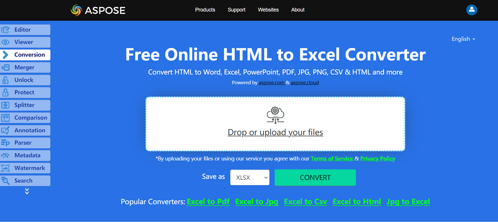

No need to wonder how to convert HTML to Excel, because Apose.Cells for .NET library has best decision.

## **Live Example**
Aspose.Cells for .NET presents you online free application [“Convert HTML to Excel”](https://products.aspose.app/cells/conversion/html-to-excel), where you may try to investigate the functionality and quality it works.

## **Converting HTML to Excel**

The code snippet below shows how to convert HTML to Excel using C#:

