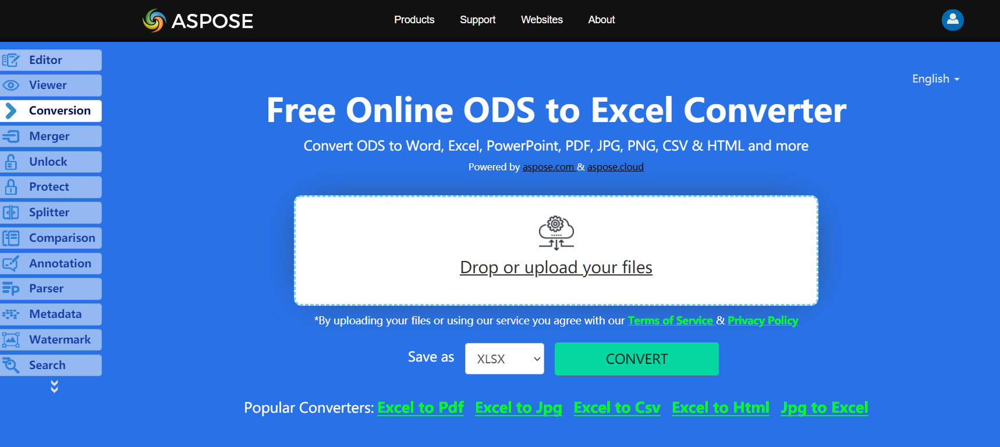

No need to wonder how to convert ODS to Excel, because Apose.Cells for .NET library has best decision.

## **Live Example**
Aspose.Cells for .NET presents you online free application [“Convert ODS to Excel”](https://products.aspose.app/cells/conversion/ods-to-excel), where you may try to investigate the functionality and quality it works.

## **Converting ODS to Excel**

The code snippet below shows how to convert ODS to Excel using C#:

