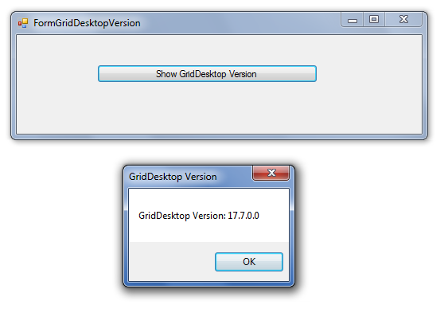

## **Possible Usage Scenarios**
Sometime, it is important to find the GridDesktop version at runtime. For example, you want to make sure that you are using the correct version or you are debugging your application and you want to know the version of GridDesktop currently in use. GridDesktop provides Aspose.Cells.GridDesktop.GridDesktop.GetVersion() method which returns the GridDesktop version at runtime. 
## **Find GridDesktop Version at Runtime**
The following sample code finds the GridDesktop version at runtime. The screenshot shows the result of the execution of this sample code for a reference.

## **Sample Code**

