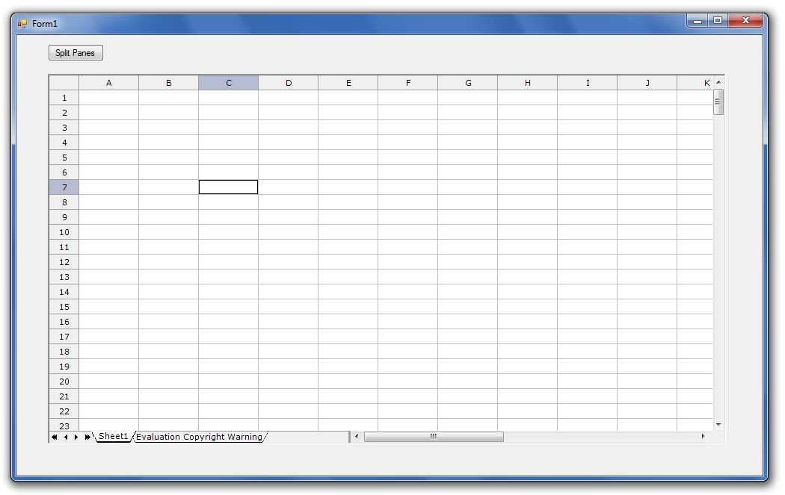

## **Possible Usage Scenarios**
Microsoft Excel allows you to split panes using View > Split menu command. Aspose.Cells also provides this feature. Please use GridDesktop.DoSplit() and GridDesktop.UnDoSplit() methods to split and unsplit panes in GridDesktop worksheet.
## **Split Panes in GridDesktop Worksheet**
The following screenshots shows the GridDesktop before split planes and after split planes.
### **GridDesktop Before Split Panes**

### **GridDesktop After Split Panes**

