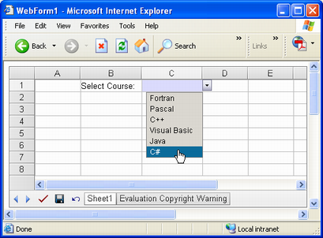
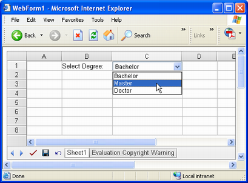
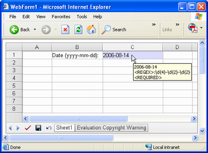
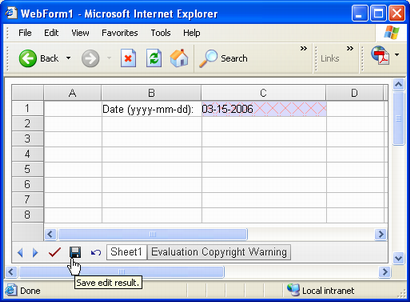

{} 

One of Aspose.Cells.GridWeb's advanced features is to add input validation rules for cells. Developers can create different types of validation rules for cells to control and validate input values. This topic discusses the validation types supported and how to create them.

{} 
## **Types of Validations**
Three types of validations can be applied using Aspose.Cells.GridWeb:

- List validation.
- Drop-down list validation.
- Custom expression validation.

Each is discussed in detail below.
### **List Validation**
List validation allows users to provide cell input either by typing or selecting a value from a menu. To create a list validation for a cell:

1. Add the Aspose.Cells.GridWeb control to a Web Form.
1. Access a worksheet.
1. Access the cell to add validation to.
1. Create the validation for the cell and specify the validation type as List.
1. Add values for the list validation.

The example code adds a list validation to C1. When a user clicks the cell, a list appears.

**Output: selecting a value from the list** 


### **Drop-down List Validation**
Drop-down list validation allows users to provide input for cells by selecting a value from a pre-defined list. To create a drop-down list validation:

1. Add the Aspose.Cells.GridWeb control to a Web Form.
1. Access a worksheet.
1. Access the cell to create the validation for.
1. Create a validation for the cell and specify the type as DropDownList.
1. Add values for the validation.

The example code adds a drop-down list validation to C1. When a user clicks the cell, a drop-down appears and users can select a value from it.

**Selecting a value from a drop-down** 


### **Custom Expression Validation**
Custom expression Validation allows developers to write their own custom regular expressions to validate input values. To create a custom expression validation:

1. Add the Aspose.Cells.GridWeb control to a Web Form.
1. Access a worksheet.
1. Access the cell to create a validation for.
1. Create a validation for the cell and specify the type as CustomExpression.
1. Set the validation's regular expression.

The sample code adds a custom expression validation to C1. Users can only add a date into the cell as per the format specified by the regular expression.

**Adding a date value to C1 according to a regular expression** 


### **Forcing Validation**
Using Aspose.Cells.GridWeb, users may post input data to a server. Even if there are validation rules for different cells but the GridWeb control's ForceValidation property is not set to true, input data that's wrong will also be submitted to the server and no validation is forced. The GridWeb's ForceValidation property is always set to true by default.

When the ForceValidation property is true the control does not post data to the web server until the input values of all cells are valid. For example, if someone enters an invalid input value into a cell, or don't enter a value, the client-side validation is activated and the users can't post data even if they click **Submit**.

**Wrong input value highlighted by GridWeb** 

