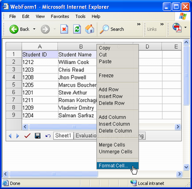
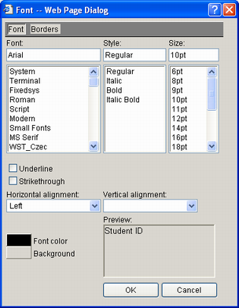
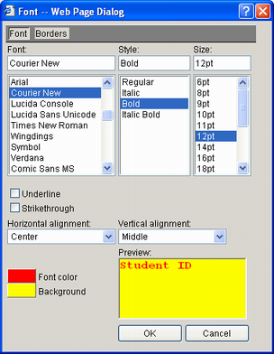
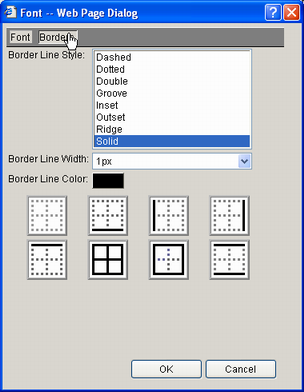
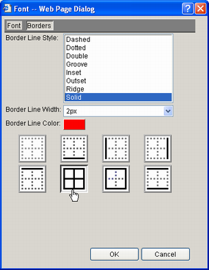
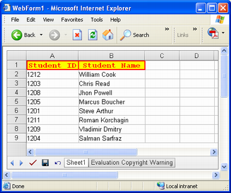
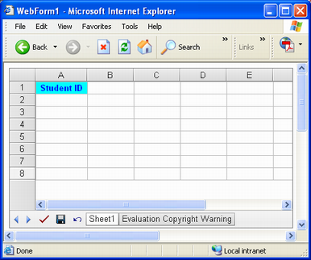
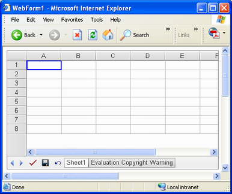
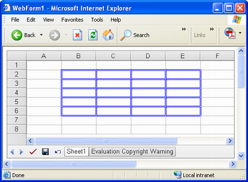
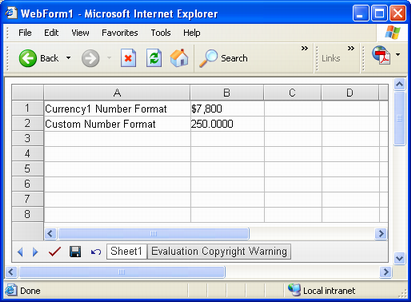

{} 

This topic provides a detailed discussion about how to format cells.

It covers formatting cells in GUI mode using the Aspose.Cells.GridWeb control's Style dialog. It also shows how to format cells programmatically. Different format settings like font, border and number format are discussed, illustrated with examples.

{} 
## **Formatting Cells Using the Style Dialog**
Cells can be formatted [programmatically](/cells/net/format-cells/) but the easiest way to format cells in the Aspose.Cells.GridWeb control in a WYSIWYG way, is using the Style dialog.

To use the Style dialog:
Select a range of cells then right-click and select **Format Cell**. 

**Selecting Format Cell** 

The Style dialog is displayed. 

**The Style dialog is used to format cells** 

The Style dialog lets users format cells by customizing font and border settings.
### **Customizing Font Settings**
You can customize the following font settings using the Style dialog:

- Font name, select a desired font from the list.
- Font style, apply a font style like bold, italic etc.
- Font size, select a font size in points.
- Underline, underline text.
- Strikethrough, apply a strikethrough effect to text.
- Horizontal alignment, select horizontal alignment.
- Vertical alignment, select vertical alignment.
- Font color, select a font color.
- Background, select a color for the background.

You can check the selected font settings in a small preview area.

**Customized font settings** 

### **Customizing Border Settings**
The control also allows users to draw a border around cells by customizing border settings in the Style dialog.

To view border related options:
Click **Borders** in the Style dialog.
Border related options are displayed. 

**Border options in style dialog** 

The following border options can be selected from the Style dialog:

- Border line style, select the border style like solid, dashed etc.
- Border line width, select the border width in pixels.
- Border line color, select the line color.
- Border lines, select the numbering and positioning of border lines.

**Customized border settings** 

### **Applying Settings**
Click **OK** in the Style dialog to apply the changes.

**Font and border settings applied** 

## **Formatting Cells Using API**
Cells can also be formatted programmatically with the Aspose.Cells.GridWeb API. Each cell has a Style property, which represents a GridTableItemStyle object. Use the Style property to customize font and border settings.
### **Setting Font**
To customize font settings programmatically:

1. Add the Aspose.Cells.GridWeb control to a Web Form.
1. Access a worksheet.
1. Access the cell you are formatting.
1. Access the cell's style.
1. Set the font size in points.
1. Set the font style.
1. Set foreground and background colors.
1. Set horizontal and vertical alignment.
1. Set the style back to the cell.

**Output: customized font settings shown in A1** 


### **Setting Borders**
Borders can be applied to individual cells, or to a range.
#### **Single Cell**
To set the borders of a single cell:

1. Add the Aspose.Cells.GridWeb control to a Web Form.
1. Access a worksheet.
1. Access the cell you're about to format.
1. Access the cell's Style object.
1. Set the border style.
1. Set the border width in pixels.
1. Set the border color.
1. Set the style to the cell.

**Customized border settings on a single cell** 

{} 

It is possible to set different styles for each border line with the cell's Style.TopBorderStyle, Style.BottomBorderStyle, Style.LeftBorderStyle, Style.RightBorderStyle properties.

{} 


#### **Range of Cells**
To set borders on a range of cells:

1. Add Aspose.Cells.GridWeb control to your Web Form
1. Access a desired worksheet
1. Instantiate an object of WebBorderStyle class
1. Set Style of the Border to Solid or Dashed etc.
1. Set Width of the Border in pixels
1. Set Color of the Border
1. Apply border settings stored in WebBorderStyle object to a specified range of cells

**A range of cells with customized border settings** 


### **Setting Number Formats**
Aspose.Cells.GridWeb supports setting number formats. There are 59 built-in number formats. To see them, please refer to this [list of supported number formats](/cells/net/list-of-supported-number-formats/).

All built-in number formats are in the NumberType enumeration. To use a built-in number format, set the NumberType using SetNumberType method of a cell's object to a number format from the NumberType enumeration.

To set custom number format use the cell's SetCustom method.

**Number format settings applied on B1 and B2** 


