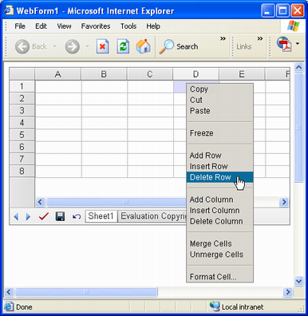
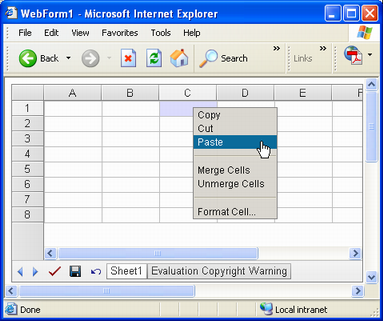

{} 

This topic discusses a few techniques for protecting cells in rows and columns from any kind of action performed by end users. Developers can implement this protection using two techniques: by making cells in rows and columns read only, or by restricting the Aspose.Cells.GridWeb's context menu options. Both of these techniques are discussed below with the help of examples.

{} 
## **Protecting Cells in Rows & Columns**
### **Making Rows & Columns Read Only**
One way of protecting rows and columns in a worksheet is to make the cells read only. Then they cannot be deleted by end users.

To make rows and columns read only:

1. Add the Aspose.Cells.GridWeb control to a Web Form.
1. Access the GridWorksheet in the collection.
1. Set your desired cells in rows or columns to read only.


### **Restricting Context Menu Options**
Aspose.Cells.GridWeb provides a context menu that end users can use to perform operations on the control. The menu provides many options for manipulating cells, rows and columns.

**Complete contextual options** 

It is possible to restrict any kind of client side operations on rows and columns by restricting the options available in the context menu. It can be done by setting the EnableClientColumnOperations and EnableClientRowOperations properties of the GridWeb control to false. It is also possible to restrict users from freezing rows and columns by setting the GridWeb control's EnableClientFreeze property to false.

**Context menu after restricting row & column options** 


