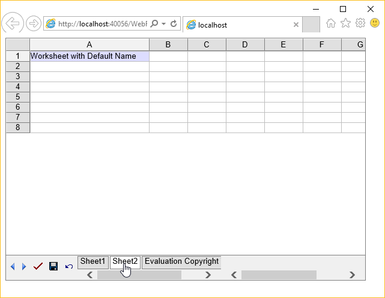
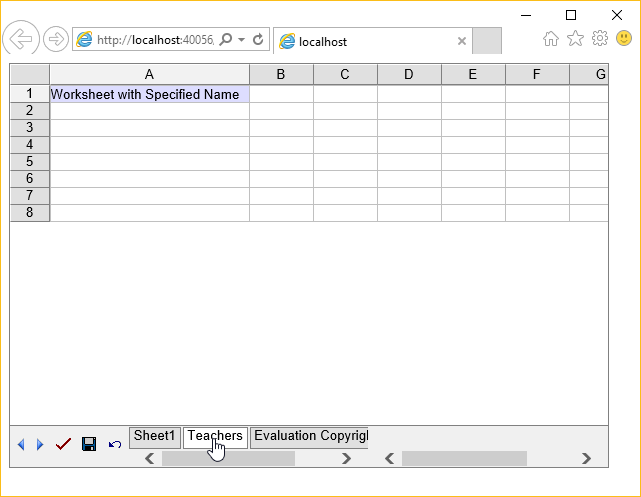

{} 

Worksheets are an integral part of Aspose.Cells.GridWeb. All data is managed and stored in the form of worksheets. Aspose.Cells.GridWeb allows developers to add one or more worksheets to the Aspose.Cells.GridWeb control. This topic shows simple approaches to adding worksheets to Aspose.Cells.GridWeb.

{} 
## **Adding a Worksheet**
### **Without Specifying Sheet Name**
The simplest way to add a worksheet to Aspose.Cells.GridWeb is to call the GridWorksheetCollection collection's Add method in the GridWeb control. This creates worksheets that use default names (that is Sheet1, Sheet2, Sheet3 and so on) and adds them to the GridWeb control.

**Output: a worksheet with default name has been added to GridWeb** 



{} 

The Add method returns the new worksheet's index which can be used to access the instance of this worksheet. For more details on how to access worksheets, read [Access Worksheets](/cells/net/access-worksheets/).

{} 
### **With Specified Sheet Name**
To add a worksheet with a specific name to the GridWeb control instead of using the default naming scheme, call an overloaded version of the Add method that takes the specified SheetName. For an instance, the example below adds a worksheet named Invoice.

**Output: a worksheet with a specified name has been added to GridWeb** 



{} 

The Add method accepting the worksheet name as string returns an instance of GridWorksheet.

{}
