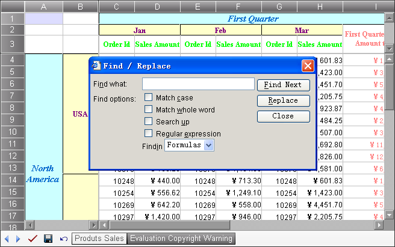

{} 

One of the fastest ways to make repetitive changes in a large spreadsheet is to use the find and replace feature. Find helps you locate a text string or data and replace substitutes it with a new value. Aspose.Cells.GridWeb provides this feature. It enables you to search for and replace with a specific text string or value in the worksheet client-side through a simple dialog. It even allows you to look for partial data.

{} 
## **Working with Find/Replace**
### **The Find/Replace Dialog**
There are two ways to open the Find/Replace dialog:

1. When the control is active, press **CTRL+F** to open the dialog, or press **CTRL+R** key to open the dialog with the **Replace** button enabled.
1. Move the cursor to the cell area in the worksheet, then right-click. Select **Find** or **Replace** from the menu. 

   **Selecting Find** 

A style dialog is displayed. 

**The Find/Replace dialog** 

### **Using Find**
To search:

1. Open the Find/Replace dialog.
1. Type the string you want to search for in the **Find what** field.
1. Click **Find Next** to search.

The next cell that matches your find condition is highlighted.

{} 

If your search criterion is not found, a dialog is displayed to tell you.

{} 
### **Searching Options**
There are some search options that you can customize in the dialog. The table below lists them.

|**No.** |**Option Name** |**Description** |
| :- | :- | :- |
|1 |Match case |Indicates whether to use case sensitive in searching. |
|2 |Match whole word |Indicates whether to match whole word in searching. |
|3 |Search up |Indicates whether the search will be done from bottom to top. |
|4 |Regular expression |When checked, the control will treat the string in the Find what text box as a regular expression in searching process. |
|5 |Find in Formulas/Values |When the Formulas is selected, the control will match the formula or unformatted value of the cells if the formula or the unformatted value is present. When the Values is selected, the control will only match the displayed value of the cells. |
### **Using Replace**
To replace text or values:

1. Open the Find/Replace dialog Box by pressing **CTRL+F**, or select right-click a cell and select **Find** before clicking **Replace**.
1. Type the replacement string in the **Replace with** field.
1. Click **Replace**.

To replace text:

1. Open the dialog box.
1. Enter the text you want to find in the **Find what** field, and the text you want to replace it with in the **Replace with** field.
1. Replace one occurence at a time by clicking **Find Next** followed by **Replace**.
1. If you are very sure of what the worlsheet contains, click **Replace All**.

{} 

If the worksheet is not in edit mode, the **Replace** button is not displayed.

{}
