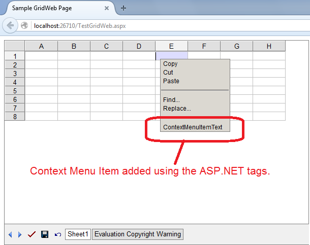
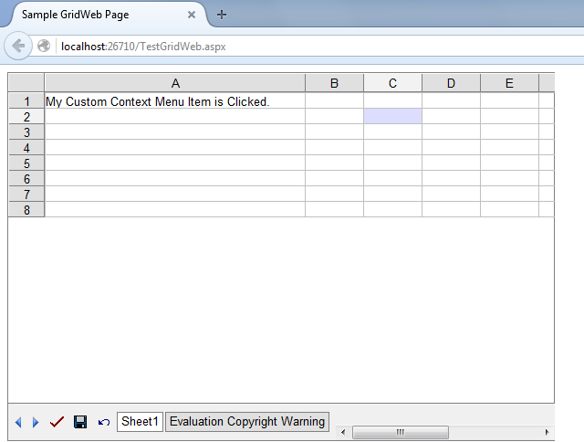

{} 

You can add context menu items using ASP.NET markup or using the .NET code. You can also remove context menu items using the .NET code. Please use GridWeb.CustomCommandButtons.Add() and GridWeb.CustomCommandButtons.Remove() or RemoveAt() methods for these purpose.

{} 
## **Add Context Menu Item using ASP.NET Markup**
The following ASP.NET markup adds context menu item in GridWeb.



Here is the full ASP.NET markup that creates a GridWeb with above context menu item. Please note the OnCustomCommand="GridWeb1_CustomCommand" attribute. It is the event handler name that will be called when your context menu item will be clicked.



The is how the context menu item looks like after being added using the above ASP.NET markup.

This is the event handler code which is executed when the context menu item is clicked. The code first checks the command name, if it matches our command, it adds a text in cell A1 of active GridWeb worksheet and sets the first column width to 40 units to make text visible.



This is how the GridWeb looks when you click on the context menu item.

## **Add Context Menu Items in Aspose.Cells.GridWeb using Code**
This code shows how to add context menu item inside a GridWeb using code.


## **Remove Context Menu Items in Aspose.Cells.GridWeb using Code**
This code shows how to remove context menu item using CustomCommandButtons.Remove() and CustomCommandButtons.RemoveAt() methods.


