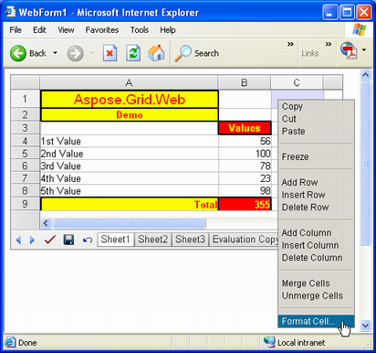

{} 

This article describes Aspose.Cells.GridWeb's different modes. These modes are differentiated logically due to their different features and behaviors. We have identified several types of mode:

- Edit Mode
- View Mode
- Session Mode
- Sessionless Mode

All of these modes have their own characteristics. Developers can work with Aspose.Cells.GridWeb in any mode according to their requirements. We'll look at each mode below.

{} 
## **Edit Mode**
By default, the Aspose.Cells.GridWeb control is in Edit mode. In Edit mode, you can fully edit or modify the grid content using all the features offered by the Aspose.Cells.GridWeb control. These features include:

- Saving the grid content to Microsoft Excel files.
- Submitting data to a server.
- Calculating formulas.
- Undoing or discarding previous actions.
- Managing rows and columns.
- Cutting, copying or pasting data.
- Formatting cells etc.

**GridWeb control in Edit Mode** 

Developers can also switch to Edit mode programmatically by setting the EditMode property of the GridWeb control to true.

The below example shows how to enable edit mode programmatically.



{} 

Whenever a user clicks the **Undo** button, it brings the GridWeb to its previous state (the state before the last postback to the server). It does not cancel previous actions one by one.

{} 
## **View Mode**
When the GridWeb control is in View mode, users cannot edit or modify grid content, which means that users can only view grid content. That's why this mode is called View mode. In View mode, a few buttons (**Submit**, **Save** and **Undo**) are hidden and the menu that appears when right-clicking only contains the **Copy** option.

**GridWeb control in View Mode** 

If developers would like their users to only view data then they can switch to View mode programmatically by setting the GridWeb control's EditMode property to false.

The below example shows how to enable view mode programmatically



{} 

Even in View mode, users can change the height and width of rows and columns.

{} 
## **Session Mode**
The Aspose.Cells.GridWeb control holds sheet data in the User Session of the web server between each requests of a web user. It means that GridWeb control always works in Session mode by default. However, if you're not working in Session mode, switch it on by setting GridWEb control#s SessionMode property to SessionMode.Session.

The below example shows how to enable session mode programmatically


## **Sessionless Mode**
We have already discussed that Session mode approach provides the best performance by using a user session to load and store sheet data. It does, however, consume server memory. So, if there are large number of concurrent users then memory problems may arise. To save server memory and support large number of concurrent users, consider the Sessionless mode.

Sessionless mode can be turned on by setting the GridWeb control's SessionMode property to SessionMode.ViewState.

The below example shows how to enable sessionless mode programmatically



{} 

IMPORTANT: When the GridWeb's SessionMode property is set to SessionMode.ViewState, the grid stores data in the page's ViewState. That means the rendered page is larger, and consumes more network traffic.

{} {} 

If you want to use SQL Server or StateServer to hold sessions, use Session mode. The GridWeb control supports serializing its data to SQL Server or StateServer.

Please check the following article for more help.

- [Working of GridWeb when ASP.NET Session state mode is SQL Server](/cells/net/working-of-gridweb-when-asp-net-session-state-mode-is-sql-server/)

{}
