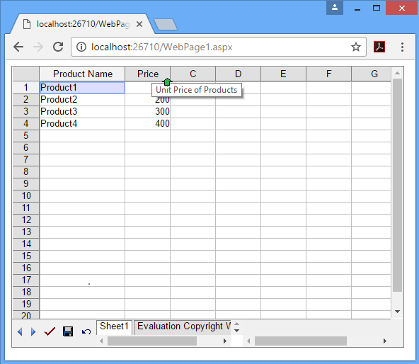

## **Possible Usage Scenarios**
You might need to set tooltip for your custom column while creating the table in the worksheet. Aspose.Cells.GridWeb allows you to rename a column's caption and you may set tooltip to the column, so the users could easily understand what is the column for.
## **Setting Column Header Tip**
A complete example is given below to demonstrate how to change columns' captions and apply tooltip text. After executing the above example code, tooltip text would be popped out when you place the mouse cursor over the specified column's header as shown below.

## **Sample Code**
Here is the sample script of the **ASPX Page**.



Here is the sample code of the **ASPX Code Behind CS File**.


