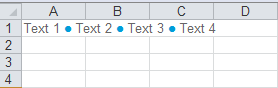

{}

Aspose.Cells supports showing bullets with HTML code. This article will explain how to display bullets by setting cell value using HTML. We will use [**Cell.HtmlString**](https://reference.aspose.com/cells/net/aspose.cells/cell/properties/htmlstring) property to set the cell value with our HTML.

{}

## C# code to display Bullets by setting Cell value using HTML

The following code uses the HTML code to set the cell value. Once, you will run this code, you will get the output as shown in the image below.



## Output generated by the sample code

The following screenshot shows the output of the above sample code.

