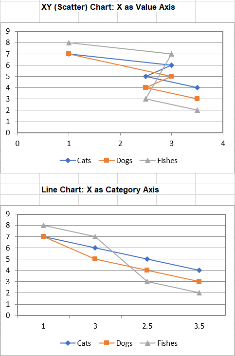

## **Possible Usage Scenarios**
There are different types of X axes. While the Y axis is a Value type axis, the X axis can be a Category type axis or a Value type axis. Using a Value axis, the data is treated as continuously varying numerical data, and the marker is placed at a point along the axis which varies according to its numerical value. Using a Category axis, the data is treated as a sequence of non-numerical text labels, and the marker is placed at a point along the axis according to its position in the sequence. The sample below illustrates the difference between Value and Category Axes.
Our sample data is shown in the [sample Table file](sample.png) below. The first column contains our X axis data, which can be treated as Categories or as Values. Note that the numbers are not equally spaced, nor do they even appear in numerical order.

We will display this data on two types of chart: a Line Chart, and an XY Scatter Chart; these charts look the same but behave differently.
## **Handle X and Category axis like Microsoft Excel**
The first chart is XY (Scatter) chart X as Value Axis,and the second chart is line chart: X as Category Axis

## **Sample Code**

