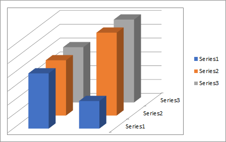

## **Possible Usage Scenarios**
For some 3-D charts such as 3-D column, 3-D cone, or 3-D pyramid which has a depth (series) axis, also known as the Z axis, that you can change. You can specify the interval between tick marks, axis labels and other operation.
## **Handle Primary and Second Axis like Microsoft Excel**
Please see the following sample code that create a new Excel file and put values of the chart in the first worksheet. Then we add a chart and set the chart type to Column3D,then you can see the Z Axis also called Depth Axis. 

## **Sample Code**

