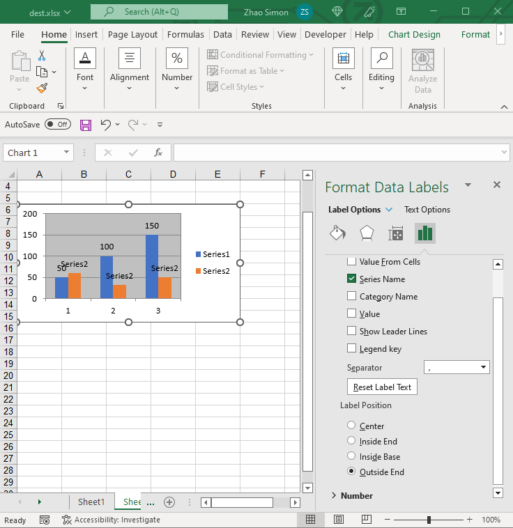

{}

DataLabels are an important part of a chart.
We can easily know the value, percentage, etc. of each series

{}

## **DataLabels Options**
Aspose.Cells also allows to manage chart's datalabels at runtime，with [DataLabels](https://reference.aspose.com/cells/net/aspose.cells.charts/datalabels/) object, it's simple to move, update and format datalabels of the chart.

||

## **Manage the DataLabels of Chart**
It's simple to manage datalabels of the chart with Aspose.Cells [DataLabels](https://reference.aspose.com/cells/net/aspose.cells.charts/datalabels/).

The following code snippet demonstrates how to manage DataLabels:

