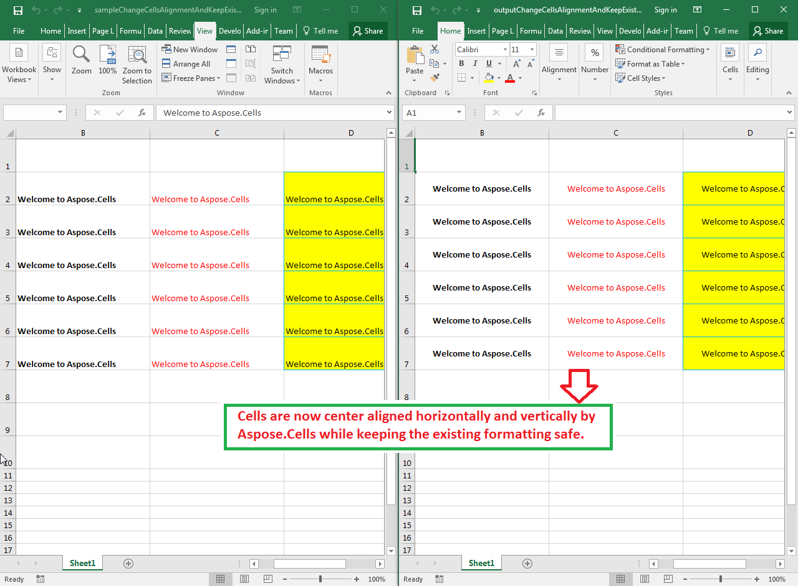

## **Possible Usage Scenarios**

Sometimes, you want to change the alignment of multiple cells but also want to keep existing formatting. Aspose.Cells allows you to do it using the [**StyleFlag.Alignments**](https://apireference.aspose.com/cells/net/aspose.cells/styleflag/properties/alignments) property. If you will set it **true**, changes in alignment will take place otherwise not. Please note, [**StyleFlag**](https://apireference.aspose.com/cells/net/aspose.cells/styleflag) object is passed as a parameter to [**Range.ApplyStyle()**](https://apireference.aspose.com/cells/net/aspose.cells/range/methods/applystyle) method which actually applies the formatting to a range of cells.

## **Change Cells Alignment and Keep Existing Formatting**

The following sample code loads the [sample Excel file](67338585.xlsx), creates the range and center aligns it horizontally and vertically and keeps the existing formatting intact. The following screenshot compares the sample Excel file and [output Excel file](67338586.xlsx) and shows that all existing formatting of the cells is the same except that cells are now center aligned horizontally and vertically.

## **Sample Code**


