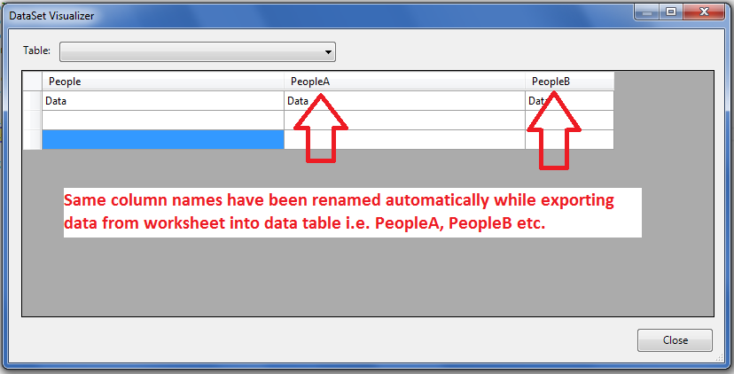

## **Possible Usage Scenarios**

Sometimes user faces a problem of duplicate columns while exporting data from worksheet into the data table. DataTable cannot have duplicate columns so duplicate columns must be renamed before you could export worksheet data to the data table. Aspose.Cells can rename the duplicate columns automatically according to strategy specified by you with [**ExportTableOptions.RenameStrategy**](https://apireference.aspose.com/cells/net/aspose.cells/exporttableoptions/properties/renamestrategy) property. If you specify [**RenameStrategy**](https://apireference.aspose.com/cells/net/aspose.cells/renamestrategy).Digit, columns will be renamed like column1, column2, column3, etc. and if you specify [**RenameStrategy**](https://apireference.aspose.com/cells/net/aspose.cells/renamestrategy).Letter, then columns will be renamed like columnA, columnB, columnC, etc.

## **Rename duplicate columns automatically while exporting worksheet data**

The following sample code adds some data in the first three columns of the worksheet but all columns have the same name i.e. *People*. Then it exports the data from worksheet into data table by specifying [**RenameStrategy**](https://apireference.aspose.com/cells/net/aspose.cells/renamestrategy).Letter strategy. It then prints the column names of the data table generated by Aspose.Cells. The following screenshot shows the data table with exported data in the visualizer. As you can see, duplicate columns have been renamed to PeopleA, PeopleB etc.

## **Sample Code**



## **Console Output**

Here is the console output of the above sample code for a reference.



People

PeopleA

PeopleB


